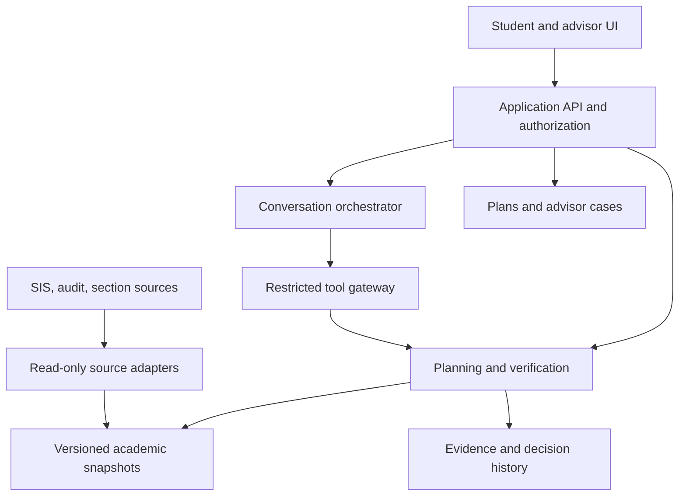

# System architecture and technical design

Version: 0.1 | Date: September 25, 2026 | Status: Proposed baseline; not institutionally approved

## Architectural stance

Use a modular monolith for V1 with isolated background workers. The application is small enough that distributed microservices would add operational work without resolving the main risk: inconsistent academic semantics. Separate module contracts now so the solver or integrations can move later if measured load requires it.

Suggested, not locked, implementation: TypeScript web client/API, PostgreSQL for structured app state, encrypted object storage for permitted immutable source snapshots, and a worker queue for imports and validations. A solver worker can use a separate runtime if needed. Choose exact libraries, model provider, hosting region, and identity SDK after institutional constraints and a feasibility spike; no version-specific dependency assumptions are made here.

## Component view

The diagram is logical, not a deployment promise. Conversation has no direct connection to databases or institutional systems. Evidence retention follows privacy policy; “history” does not mean indefinite retention.

## Modules and ownership

| Module | Responsibility | Prohibited authority |
|---|---|---|
| Identity/access | Tenant context, role, advisor assignment, session | Trusting client-provided role or tenant |
| Source adapters | Validate/map allowed records into canonical snapshots | Inventing missing values or overriding source semantics |
| Academic read model | Pin related records and preserve provenance | Making unofficial source corrections |
| Audit gateway | Fetch authoritative audit and hypothetical allocation if available | Claiming generic local audit completeness |
| Eligibility validator | Evaluate supported rules against pinned data | Treating unknown as passing |
| Schedule planner | Search within hard constraints, rank soft preferences | Removing a hard rule to obtain a result |
| Evidence renderer | Render academic fields and reason codes | Replacing evidence with model confidence |
| Conversation | Parse intent, propose preferences, navigate approved facts | Approving exceptions or generating eligibility facts |
| Cases | Route unresolved matters to authorized humans | Altering official academic decisions |
| Administration | Coverage, adapters, approvals, health | Silent activation of unreviewed rules |

## Request lifecycle

Authenticate and authorize → resolve supported program/catalog → acquire a consistent snapshot set → check freshness and mapping coverage → obtain candidate applicability from the audit gateway → validate eligibility and schedules → persist immutable result revision → render structured evidence → optionally add non-consequential conversational text.

The plan response is bound to `student_snapshot_id`, `audit_snapshot_id`, `section_snapshot_id`, `ruleset_version`, `adapter_version`, `engine_version`, and a normalized constraint hash. A policy response also records the policy revision and effective date. A model version belongs to explanation metadata, not the academic truth key.

## Consistency model

Institutional sources may not share a transaction. Record both source effective times and ingestion times. If transcript or program data is newer than the audit used to evaluate it, request regeneration or return UNKNOWN for affected checks. A recent import timestamp must not hide an old source audit. Define partner-specific maximum skew; until approved, mismatched dependent snapshots block validated recommendations.

Save a new plan revision only after validation completes. Revalidate on reopen when freshness expires or a dependency changes. Keep the historical result readable with its original timestamp and status. Advisory review does not freeze the SIS; reviewed plans can still become stale.

## Integration modes

Preferred: permitted API or controlled structured export with source IDs and refresh semantics. Batch feeds are acceptable if their latency supports the intended claim. Seat-level availability may be unavailable in batch mode; suppress that claim rather than pretending a nightly feed is live. Public PDFs may support reviewed policy content but not personalized eligibility decisions.

A vendor audit is usable only after validating its semantic coverage. If hypothetical planned-course allocation cannot be established, V1 can show existing audit requirements and advisor-review candidates but must not label a whole proposed schedule degree-applicable. Narrow the pilot or add a formally scoped reviewed mapping module; this is a go/no-go decision.

## Failure containment

Use separate disable flags for personalized planning, conversational explanations, a cohort, and an adapter. Source outages should not crash read-only historical views. LLM outages should leave forms, verified plan cards, and case access operational. Tenant-aware caches and queue payloads are mandatory. No global cache may store one student's result under a course-only key.

_Decision note (2026-09-29, ADR-0008 Amendment 1, #114):_ "Read-only historical views" means saved results shown with their original timestamp and status, such as plan revisions (AC14). The live academic summary is not one of them. When its sources are past the maximum age, it returns 409 `STALE_SOURCE` with an advisor referral, the same as course checks, until a historical-view UX with a server-derived marker exists (revisit before G1).

Retry transient read errors with bounded backoff. Quarantine malformed imports. Use last-known-good configuration only if applicable and fresh; otherwise display unavailable. Authentication failure, semantic mismatch, and missing permissions are not retryable transient errors.

## Deployment and delivery

Separate synthetic development, controlled staging, and production. No production student records in local development. Apply schema migrations with rollback/backward compatibility, configuration versioning, dependency scanning, and staged cohort enablement. Maintain a software inventory. Infrastructure-as-code and deployment details are implementation deliverables after vendor/region selection.

## Deferred architecture

Registration execution needs transaction integrity, idempotent vendor operations, real-time revalidation, explicit approvals, and reconciliation. Multi-institution SaaS needs additional tenant lifecycle and support procedures. A full audit engine needs an independently specified rule language and exhaustive allocation semantics. None is implied by this V1 architecture.
