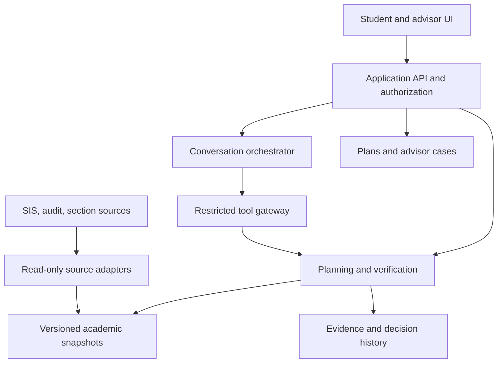

# AI Student Advising — Complete SDLC Foundation

# Verified Advising Runtime — SDLC foundation

Version: 0.1 | September 25, 2026 | Proposed planning baseline

This package turns the supplied research into a coordinated pre-implementation foundation. It contains the original answer plus 16 planning documents. It does not claim that stakeholder discovery, institutional approvals, prototypes, tests, or integrations have been completed. The working product name is descriptive, not a selected brand.

## Recommended reading order

Start with the project proposal, product requirements, architecture, academic verification contract, and open questions. Then use the remaining documents as review workstreams. Read the preserved research with its citation limitations in mind.

## Proposed V1 in one paragraph

One institution, one department, two or three qualified programs, one initial catalog cohort, and next-term planning using published sections. Consume an authoritative degree audit. Keep institutional academic integrations read-only. Save local drafts and advisor cases. Render consequential academic facts from structured validated results; use AI for intent and navigation. Missing or conflicting authority produces visible uncertainty and referral. Multi-year guarantees, full audit replacement, major-change optimization, registration writes, and predictive risk models are deferred.

## Document map

| File | Purpose | Primary reviewer |
|---|---|---|
| [01-initial-research-original.md](01-initial-research-original.md) | Initial research — original supplied answer | Product/research |
| [02-research-assessment-and-sources.md](02-research-assessment-and-sources.md) | Research assessment, evidence, and discovery plan | Product/research |
| [03-v1-project-proposal.md](03-v1-project-proposal.md) | V1 project proposal and business case | Sponsor |
| [04-charter-stakeholders-and-governance.md](04-charter-stakeholders-and-governance.md) | Project charter, stakeholders, and governance | Sponsor/partner |
| [05-product-requirements.md](05-product-requirements.md) | Product requirements document | Product/advising |
| [06-system-requirements-and-traceability.md](06-system-requirements-and-traceability.md) | System requirements and traceability | Engineering/QA |
| [07-system-architecture-and-design.md](07-system-architecture-and-design.md) | System architecture and technical design | Technical lead |
| [08-academic-verification-and-planning.md](08-academic-verification-and-planning.md) | Academic verification and planning contract | Registrar/academic lead |
| [09-data-model-and-integration-contracts.md](09-data-model-and-integration-contracts.md) | Data model, integration contracts, and lifecycle | Integration/IT |
| [10-ai-behavior-and-safety-contract.md](10-ai-behavior-and-safety-contract.md) | AI behavior, tools, and evaluation contract | AI/technical lead |
| [11-ux-and-accessibility-design.md](11-ux-and-accessibility-design.md) | UX design specification and accessibility plan | Design/accessibility |
| [12-security-privacy-and-procurement.md](12-security-privacy-and-procurement.md) | Security, privacy, threat model, and procurement plan | Privacy/security/procurement |
| [13-test-and-evaluation-strategy.md](13-test-and-evaluation-strategy.md) | Test strategy, academic evaluation, and release acceptance | QA/academic lead |
| [14-delivery-roadmap-and-backlog.md](14-delivery-roadmap-and-backlog.md) | Delivery roadmap, backlog, and stage gates | Product/engineering |
| [15-risk-assumptions-decisions-and-questions.md](15-risk-assumptions-decisions-and-questions.md) | Risk register, assumptions, decisions, and open questions | Sponsor/all leads |
| [16-operations-pilot-and-success-measurement.md](16-operations-pilot-and-success-measurement.md) | Operations, pilot protocol, and success measurement | Advising/operations |
| [17-institution-onboarding-and-rule-governance.md](17-institution-onboarding-and-rule-governance.md) | Institution onboarding and academic configuration playbook | Registrar/IT |

## Status conventions

**Source-backed:** limited evidence in the research register with original URLs and stated limitations. **Proposed:** architecture, scope, targets, timelines, and process chosen for review. **Unverified:** original unresolved citations, market statistics, and commercial assumptions. **Institution-dependent:** rule semantics, data authority, legal basis, retention, and approval requirements.

No generated document is evidence of an actual stakeholder approval. Replace role placeholders with names and dates at the relevant gate.

## Before implementation

Select a design partner and a budget/team constraint; validate the current planning problem; obtain permitted source samples; prove audit support for planned-course allocation; name an academic reviewer and escalation owner. A synthetic prototype can proceed under an accepted scope while real-record work remains gated.

## Maintenance

Keep Markdown files together to preserve relative links. Track revisions in a selected repository when implementation begins. Change requirements, tests, risks, and decisions together. The original research remains historical; add corrections in the assessment rather than rewriting the preserved answer.


---

# Initial research — original supplied answer

Version: 0.1 | Date: September 25, 2026 | Status: Proposed baseline; not institutionally approved

## Editorial note

The answer below is preserved from the supplied attachment, including its original wording, examples, tables, and citation placeholders. Line endings are normalized. This is a historical research input, not an approved product specification. The original citation markers do not resolve to URLs in the attachment; they must not be treated as verified citations. Numerical market claims, caseload statistics, customer counts, funding figures, and estimates of automatable workload remain unverified here.

Read `02-research-assessment-and-sources.md` for the current evidence assessment and corrections. In particular, absolute reliability language is an aspiration, not a guarantee; the proposed V1 is narrower than the original MVP table.

---

Yes—there is a real product opportunity here, but I would frame it more narrowly than “AI replaces the college advisor.”

The market for **degree planning, student-success software, and AI student support is already fairly competitive**. The interesting opportunity is a system where **the AI is the conversational interface, while an auditable deterministic engine makes every academic decision**.

That distinction matters. A student could ask:

> “I work 25 hours a week, I don't want Friday classes, and I want to graduate by Spring 2028. What should I take next semester?”

The LLM can understand the request. But it should **never decide what counts toward graduation**. Instead:

$$
\text{Student intent}
\rightarrow
\text{Deterministic academic engine}
\rightarrow
\text{Valid options}
\rightarrow
\text{AI explanation}
$$

That architecture is both safer and, potentially, the actual differentiator.

As of September 25, 2026, there is strong evidence that the underlying problem is real. Recent advising research found a modal advisor caseload of roughly **300–399 students**, while another study found caseload size strongly associated with advisor burnout; community-college caseloads can reach **1,200 students per advisor**. :chatgpt-content-reference{index="0"} Complete College America specifically identifies unnecessary credits, poor course sequencing, confusing requirements, and advising failures as causes of delayed graduation and additional student cost. :chatgpt-content-reference{index="1"}

So the pain you are seeing personally is not unusual.

---

# What a college academic advisor actually does

One complication is that “academic advisor” means different things at different schools. Some universities centralize advising; others use departmental or faculty advisors. Financial aid, registrar functions, career counseling, accessibility, international-student advising, and mental-health counseling may belong to separate offices.

But the academic advisor is frequently the **router and interpreter across all of them**. Universities describe advisors as handling degree audits, registration, prerequisite sequencing, major exploration, academic standing, petitions, transfer credit, graduation planning, referrals, and much more. :chatgpt-content-reference{index="2"}

Here is the product surface I would consider the complete advising domain.

| Domain | What the advisor actually does |
|---|---|
| **Student onboarding** | Determine declared/intended major; concentration; minor; degree type; campus; modality; catalog year; expected graduation date; incoming credits; placement results; academic interests; career interests; work schedule; family obligations; athletics; honors participation; visa status where relevant; accommodations; veteran status; transfer intentions; and other constraints affecting planning. |
| **Orientation** | Explain registration systems, SIS, LMS, degree audit, academic calendar, advising expectations, communication channels, student email, campus resources, deadlines, academic integrity rules, and how to get help. |
| **Student record review** | Review transcript; attempted credits; earned credits; transfer credits; GPA; institutional GPA; major GPA; repeated courses; withdrawals; incompletes; test credit; AP/IB/CLEP; dual enrollment; placement; academic standing; current registrations; holds; petitions; substitutions; waivers; and pending credits. |
| **Degree audit** | Determine exactly which requirements are complete, in progress, planned, or missing. Check university requirements, college requirements, major requirements, concentration requirements, minor requirements, general education, electives, upper-division credits, residency requirements, GPA requirements, minimum grades, capstones, internships, labs, practicum requirements and non-course milestones. |
| **Catalog-year rules** | Determine which curriculum version applies to the student and whether changing majors/minors or stopping out changes applicable requirements. Catalog rules can materially change what a student needs. |
| **Course applicability** | Determine whether a course actually satisfies a degree requirement, counts only as elective credit, satisfies multiple requirements, is prohibited from double-counting, duplicates previous credit, or does not count at all. |
| **Course sequencing** | Verify prerequisites, co-requisites, prerequisite chains, minimum grades, placement requirements, admission-to-major rules and dependencies such as Calculus I → Calculus II → Physics II → upper-level engineering. |
| **Critical-path planning** | Identify courses that unlock future coursework and courses offered only once per year so a student does not accidentally delay graduation by one or more semesters. |
| **Multi-semester planning** | Create semester-by-semester paths to graduation rather than merely deciding the upcoming semester. |
| **Credit-load planning** | Determine whether 6/9/12/15/18+ credits are appropriate; check institutional maximums; discuss overload requests; balance demanding and easier courses; and account for work/life obligations. |
| **Course scheduling** | Translate required courses into real sections while checking meeting times, conflicts, campus, online/in-person modality, labs, recitations, linked sections, start/end dates and student preferences. |
| **Course availability** | Determine whether the course is actually offered that semester and, ideally, whether historical offering patterns make future placement reasonable. |
| **Seat availability** | Check open sections, closed sections, reserved seats, waitlists, departmental permission requirements and possible alternatives. |
| **Registration readiness** | Verify registration date/time, advising PINs, mandatory advising requirements and registration holds. |
| **Registration holds** | Identify advising, registrar, bursar, financial aid, immunization, orientation, international, conduct or other holds and explain which office/process resolves them. |
| **Registration execution** | Help students add classes, drop classes, swap sections, join waitlists, request closed-course permission or navigate registration errors. Some institutions allow actual registration through advising software. |
| **Special enrollment requests** | Handle or route credit overloads, time-conflict overrides, prerequisite overrides, late adds, late drops, section changes, course auditing, pass/fail requests, cross-registration, independent study and other special enrollment cases. |
| **Add/drop decisions** | Explain whether changing the schedule affects degree progress, prerequisites, graduation timing, full-time status or future course eligibility. |
| **Withdrawals** | Explain academic consequences of withdrawing from one course or an entire semester and route financial-aid, immigration, athletics or other consequences to the responsible office. |
| **Major exploration** | Help undecided students identify plausible majors based on interests, existing credits, academic performance and career goals. |
| **Changing majors** | Perform “what-if” audits showing how completed courses apply under another program and estimate additional semesters/credits required. |
| **Minors/concentrations/certificates** | Evaluate whether adding or removing one affects graduation timing, credit requirements and course overlap. |
| **Double majors / dual degrees** | Evaluate overlapping requirements, residency requirements, additional credits, double-count restrictions and graduation timeline. |
| **Alternative majors** | When admission to a selective/competitive major becomes unlikely, help students identify parallel programs that preserve as many credits as possible. |
| **Transfer-credit evaluation** | Determine how coursework from another institution applies—or route it to faculty/registrar evaluators when academic judgment is required. |
| **Transfer articulation** | Check established equivalencies, articulation agreements and course-transfer databases. |
| **Prospective transfer planning** | Help students choose courses that will transfer to their intended destination institution. |
| **Reverse-transfer / credential mining** | Detect whether accumulated credits may already satisfy another credential or certificate. |
| **Prior learning** | Handle AP, IB, CLEP, military education, dual-enrollment, professional credential or other institution-approved prior-learning credit. |
| **Transient coursework** | Determine whether students can take a course elsewhere during summer or another term and have it transfer back appropriately. |
| **Study abroad planning** | Determine which program/coursework fits the degree, when studying abroad will least disrupt sequencing, and which credits may transfer. |
| **Internship/co-op planning** | Help fit internships, co-ops, experiential education, clinical placements or practicums into the degree path. |
| **GPA interpretation** | Explain cumulative GPA, institutional GPA, major GPA, semester GPA and sometimes separate GPA calculations tied to degree requirements. |
| **GPA forecasting** | Answer questions like “What grades do I need this semester to get back above 2.5?” |
| **Minimum-grade rules** | Recognize requirements such as “C or better in major courses” even where a lower passing grade technically earns institutional credit. |
| **Repeated courses** | Explain repeat policies, duplicate credit, grade replacement/forgiveness policies and how repeats alter prerequisites or degree progress. |
| **Academic warning** | Identify students approaching minimum academic thresholds and build recovery strategies. |
| **Academic probation** | Explain standing requirements, required advising, GPA recovery, course-load strategy and mandatory academic-success activities. |
| **Dismissal/suspension** | Explain process and deadlines and route appeals to authorized humans. |
| **Academic recovery** | Discuss tutoring, supplemental instruction, study habits, time management, reduced load, course sequencing and campus support. |
| **Early alerts** | Respond to faculty alerts, poor grades, LMS inactivity, missed assignments, attendance problems or other risk signals. |
| **Retention outreach** | Contact students who have stopped attending, have not registered, missed required milestones or appear likely to stop out. |
| **Re-enrollment** | Help returning students understand updated requirements, previous credits, academic standing and pathways to completion. |
| **Leave of absence** | Explain institutional process and academic consequences and connect students with relevant offices. |
| **Graduation planning** | Conduct final degree checks, identify remaining courses, verify residency/credit/GPA requirements and establish a final-semester plan. |
| **Graduation application** | Explain application deadlines and required processes. |
| **Graduation certification** | In some institutions advisors/registrars review whether every requirement has actually been satisfied. |
| **Commencement vs degree conferral** | Explain differences between participating in commencement and actually completing/conferring the degree. |
| **Career exploration** | Connect majors, coursework, internships and career possibilities; advisors commonly make career-center referrals. |
| **Graduate/professional school** | Help students understand prerequisite coursework and appropriate sequencing for medicine, law, graduate programs, etc., or refer to specialized advisors. |
| **Pre-professional planning** | Track courses and milestones for pre-med, pre-law, pre-dental, nursing admission and similar pathways. |
| **Campus-resource referrals** | Tutoring, writing center, disability/accessibility services, counseling, career services, financial aid, student accounts, registrar, housing, food assistance, international office, veteran services, TRIO, ombuds, dean of students, etc. |
| **Financial-aid awareness** | Know that dropping/withdrawing/repeating courses or failing academic-progress requirements can affect aid, while referring actual financial-aid determinations to financial-aid professionals. |
| **International-student awareness** | Recognize when course load, withdrawal, online courses or program changes may create immigration implications and escalate rather than giving immigration advice. |
| **Student-athlete awareness** | Recognize NCAA/institutional eligibility constraints and work with athletics compliance/advising. |
| **Accessibility** | Coordinate with accessibility services when accommodations affect academic planning without making accommodation determinations themselves. |
| **Personal difficulties** | Recognize when academic issues are actually caused by financial, health, family, transportation, housing, childcare or other problems and connect the student with support. |
| **Mental-health/crisis situations** | Recognize warning signs and immediately route appropriately rather than attempting counseling. |
| **Petitions** | Help initiate or review petitions involving substitutions, waivers, exceptions, late actions, overloads, withdrawals or other academic rules. |
| **Exceptions** | Enter or document approved curriculum exceptions so the degree audit correctly reflects them. |
| **Forms** | Help students locate, understand and complete forms for program changes, registration issues, appeals and other academic processes. |
| **Policy interpretation** | Explain catalog policies, deadlines, grading rules, academic standing, registration policy, repeated-course rules, residency requirements and institutional procedures. |
| **Deadline management** | Registration opening, add/drop, withdrawal, graduation application, major applications, scholarship deadlines, financial-aid steps and other academic milestones. |
| **Appointment scheduling** | Book regular advising appointments, mandatory appointments, drop-ins and follow-ups. |
| **Appointment preparation** | Review the record before meeting so the advisor understands current progress and issues. |
| **Advising notes** | Record what was discussed, decisions made, student concerns, referrals, action items and future follow-ups. |
| **Case management** | Maintain open issues, referrals and action items across multiple campus offices. |
| **Advisor handoff** | Transfer a student between general advising, departmental advising, specialized advising or another campus office without losing context. |
| **Student communication** | Email/SMS students about registration, deadlines, holds, risk alerts, graduation requirements and other necessary actions. |
| **Proactive campaigns** | Find cohorts such as “CS majors missing Calculus I,” “students with 90+ credits who haven't applied to graduate,” or “students who haven't registered” and contact them. |
| **Student self-service education** | Teach students how to understand their own degree audit and make increasingly independent decisions. |
| **Goal setting** | Help students articulate academic, professional and personal goals and connect those goals to an educational plan. |
| **Plan revision** | Recalculate the academic plan when a course is failed, withdrawn, unavailable, changed, completed elsewhere or removed from the curriculum. |
| **Curriculum-change handling** | Understand how new requirements affect different catalog cohorts and preserve old rules where required. |
| **Advisor collaboration** | Share appropriate notes/context among advisors, faculty and student-support staff. |
| **Course-demand forecasting** | Aggregate student plans to identify likely shortages in specific courses or sections. |
| **Bottleneck detection** | Identify courses or requirements causing widespread delayed progression. |
| **Program analytics** | Track retention, completion, excess credits, registration behavior, academic risk, advisor workload and intervention results. |
| **Curriculum feedback** | Tell departments when students repeatedly encounter unclear requirements, prerequisite problems or capacity bottlenecks. |
| **Orientation/workshops** | Run registration workshops, major-exploration sessions, probation workshops, transfer sessions and graduation planning sessions. |
| **Documentation upkeep** | Keep advising guides, FAQs, curriculum sheets, suggested plans and internal processes current. |
| **System testing** | Advisors are sometimes involved when degree-audit rules, SIS changes or registration processes are tested. |
| **Confidentiality** | Protect education records and control what can be shared with parents, faculty or others under FERPA and institutional policy. |

That scope is why replacing an advisor with “a chatbot connected to the catalog” would fail.

The advisor is effectively performing:

$$
\text{rules engine} + \text{planner} + \text{case manager} + \text{knowledge base} + \text{router} + \text{coach}
$$

NACADA itself describes advising competency in three broad dimensions—**conceptual, informational, and relational**—rather than merely course registration. :chatgpt-content-reference{index="3"}

---

# The architecture boundary I would enforce

I'd classify capabilities into three different authority levels.

| Authority | Examples | Implementation |
|---|---|---|
| **Deterministic system** | Degree requirements, eligible courses, prerequisites, GPA calculations, catalog year, credit counting, graduation progress, registration eligibility, course applicability, double-count rules, term availability | Rules/constraint engine |
| **AI assistance** | Understand questions, gather goals/constraints, explain requirements, summarize records, compare validated options, explain why a plan works, draft messages, provide reminders, help students navigate processes | LLM using tools |
| **Human authority** | Curriculum exceptions, ambiguous transfer evaluations, petitions, overrides, academic-dismissal appeals, sensitive personal situations, accessibility determinations, immigration issues, financial-aid determinations, crisis situations | Advisor / registrar / appropriate specialist |

The most important technical rule would be:

> **The LLM never creates an academic fact. It can only retrieve, translate, explain or act upon facts returned by authoritative services.**

So the model is prohibited from outputting:

> “CS 341 should count toward your software elective.”

unless the academic engine has returned something equivalent to:

```text
course: CS 341
applies_to: BSCS.SOFTWARE_ELECTIVE
rule_id: BSCS-2026-R42
status: VALID
credits_applied: 3
catalog_version: 2026-2027
```

The model can then say:

> “Yes. CS 341 satisfies one of your Software Elective requirements under your 2026–27 Computer Science catalog.”

That is a radically different reliability model from RAG over a course catalog.

---

# The deterministic academic engine

This is probably the actual heart of the company.

You would need a canonical representation of:

| Entity | Important information |
|---|---|
| Student | program, catalog year, majors/minors, concentrations, completed courses, attempted courses, grades, credits, transfer credit, placements, current enrollment, holds, exceptions, standing |
| Program | degree, college, major, concentration, catalog version |
| Requirement | AND/OR groups, minimum courses, minimum credits, GPA constraints, minimum grades, residency, course level, reuse restrictions |
| Course | credits, attributes, prerequisites, co-requisites, exclusions, repeats, equivalencies |
| Section | term, instructor, campus, modality, time, seats, restrictions, waitlist |
| Academic policy | effective dates, thresholds, conditions, exceptions |
| Exception | student, requirement, authorized substitution/waiver, approver, effective date |
| Term | registration window, deadlines, credit limits |
| Degree audit | satisfied/in-progress/unsatisfied requirements and evidence |
| Plan | future terms, courses and validation state |

Requirement syntax must support ugly real-world rules such as:

> Complete 12 credits from Group A, including at least one 4000-level course, but no more than 6 credits of independent study, with a grade of C or better, and at least 6 credits completed in residence.

That is where these products become difficult.

CollegeSource's uAchieve explicitly advertises handling multiple degrees, substitutions, waivers, non-course requirements, complex GPA calculations, course reuse restrictions, residency rules, transfer articulation, financial/athletic eligibility and other complex curriculum conditions. It has been working on degree-audit logic for decades. :chatgpt-content-reference{index="4"}

**That is a warning for you:** the difficult engineering problem isn't the AI.

It's encoding the university.

---

# Course planning should be constraint solving, not language generation

Suppose the audit determines that the student still needs:

```text
CS 320
CS 330
1 software elective
1 science elective
6 general electives
```

Your planning engine can calculate:

$$
C = C_{\text{remaining requirements}}
$$

Then eliminate anything violating hard constraints:

$$
C'
=
C
-
C_{\text{prereq invalid}}
-
C_{\text{already completed}}
-
C_{\text{not offered}}
-
C_{\text{program restricted}}
-
C_{\text{duplicate}}
$$

Then construct schedules subject to:

$$
\sum_i credits_i \leq creditLimit
$$

and:

$$
time_i \cap time_j = \varnothing
$$

along with prerequisites, co-requisites, linked labs, campus travel time, section restrictions, etc.

Then deterministic optimization can prefer things such as:

- critical-path courses first;
- courses offered infrequently;
- courses unlocking the greatest number of later requirements;
- degree-applicable credits rather than unrestricted electives;
- the student's desired graduation date;
- their maximum desired credit load;
- scheduling preferences.

An LLM does not need to perform any of that.

It can merely ask:

> “Would you rather avoid mornings or avoid Fridays?”

and convert the response into structured solver constraints.

---

# Your AI becomes dramatically more useful once the engine is trusted

Then conversations become genuinely powerful.

A student could say:

> “I failed Calc II. Did I screw up my graduation date?”

The system runs the audit again and dependency graph, discovers Calc II → Physics II → CS 401 → CS 498, checks when each course is offered and returns:

> Calc II has delayed one prerequisite chain. Your existing Fall 2028 plan is no longer valid because CS 401 requires Physics II. I found two valid alternatives:
>
> Plan A keeps Spring 2029 graduation by taking Calc II this summer.
>
> Plan B avoids summer courses but moves graduation to Fall 2029.
>
> These results use your 2026 BSCS requirements and the current published course schedule.

That's where conversational AI provides massive value without becoming the source of truth.

---

# The competitive landscape

This is **not an empty market**.

And several competitors are strong.

### Degree audit and academic planning

| Company | Existing capabilities | Competitive implication |
|---|---|---|
| **Stellic** | Degree audit, multi-semester planning, what-if major exploration, transfer rules, course search, registration, advisor notes, appointments, alerts and academic pathways | Very direct competitor |
| **CollegeSource uAchieve** | Extremely mature degree-audit engine, automated planning, schedule building, complex curriculum rules, transfer articulation | Very direct rules-engine competitor |
| **Kuali Advisor** | Real-time audit and planner that explicitly shows only open, degree-applicable courses validated against prerequisites | Very close to your deterministic-planning idea |
| **Ellucian Degree Works** | Long-established degree audit, planning and transfer-articulation tooling integrated with SIS infrastructure | Major incumbent |
| **Workday / other SIS vendors** | Student records, registration, academic requirements and related student functionality | Existing system-of-record competition |

Stellic now markets a broad student-journey platform covering prospective pathways, transfer, degree audit, planning, advising and student-support workflows. It reports supporting more than **1 million students**. :chatgpt-content-reference{index="5"}

Kuali is particularly relevant because its current Advisor product says its planner surfaces **only open, degree-applicable classes**, validating against the degree audit and prerequisites. :chatgpt-content-reference{index="6"}

uAchieve's current planner automatically creates semester-by-semester pathways from the student's degree requirements and updates them as outcomes, prerequisites and curriculum change. :chatgpt-content-reference{index="7"}

So **“software that deterministically recommends correct classes” is already a product category.**

### Student-success/advising platforms

EAB's Navigate360 is formidable. EAB reports **850+ institutions and 10+ million students served**, and its current platform includes advising, degree/course planning, alerts, appointments, campaigns, holds, student support and embedded AI. Its student AI provides institution-approved answers, guidance, reminders and next steps. :chatgpt-content-reference{index="8"}

Civitas similarly combines student records, alerts, case management, communications, degree planning, scheduling, predictive analytics and AI. :chatgpt-content-reference{index="9"}

Salesforce Education Cloud now advertises AI-assisted holistic advising, student summaries, intelligent degree planning, case management and Agentforce-powered student guidance. :chatgpt-content-reference{index="10"}

### AI-first companies

This portion is getting crowded quickly.

Element451 has a literal **“Bolt Academic Advisor”** that monitors academic progress, answers advising questions, handles student support and works alongside financial-aid, career, athletics and campus-life agents. :chatgpt-content-reference{index="11"}

Element also reports serving **350+ institutions**, and received a **$175 million strategic investment** from PSG in 2024, meaning you would not be competing solely against tiny AI startups. :chatgpt-content-reference{index="12"}

Ocelot already offers institution-specific higher-ed AI chatbots tied into SIS/CRM information. :chatgpt-content-reference{index="13"}

Mainstay has spent years doing conversational AI and proactive nudging around admissions, financial aid, enrollment and persistence. :chatgpt-content-reference{index="14"}

So the broad market looks roughly like:

$$
\underbrace{\text{SIS}}_{\text{student truth}}
+
\underbrace{\text{degree audit}}_{\text{curriculum truth}}
+
\underbrace{\text{student success CRM}}_{\text{workflow}}
+
\underbrace{\text{AI agent}}_{\text{conversation}}
$$

Many established vendors are actively trying to own several of those boxes simultaneously.

---

# Where I think the actual wedge exists

I would **not** initially try to replace Degree Works, Banner, Navigate360, Stellic, Workday or an advising department.

That forces you into a massive institutional replacement sale.

Instead, build something closer to a:

## **Verified Advising Runtime**

It sits **on top of the systems the university already has**.

```text
                        Your product
                  ┌────────────────────┐
 Student ────────▶│ Conversational AI  │
                  ├────────────────────┤
 Advisor ────────▶│ Advising Workspace │
                  ├────────────────────┤
                  │ Verification Engine│
                  └─────────┬──────────┘
                            │
           ┌────────────────┼─────────────────┐
           │                │                 │
      Degree Audit         SIS          Course Schedule
    Degree Works/etc.   Banner/etc.        Registrar
           │                │                 │
           └────────────────┼─────────────────┘
                            │
                        LMS / CRM
```

Your pitch becomes:

> **Students get 24/7 advising, but the AI is never allowed to invent academic requirements. Every recommendation is validated against the institution's actual degree, policy and enrollment systems and can show exactly why it made the recommendation.**

That is a much more compelling procurement story than:

> “We have an AI advisor.”

Everyone now has an AI advisor.

---

# The really interesting differentiator: proof

I would make every consequential answer inspectable.

Student sees:

**Why am I taking MATH 221?**

> Required for your BS Computer Science degree.
>
> Satisfies: Mathematics Core → Calculus II  
> Credits: 4  
> Minimum grade: C  
> Unlocks: PHYS 211 and CS 340  
> Requirement source: 2026–27 BSCS catalog  
> Status: Required

Then:

**Why can't I take CS 440?**

> Prerequisite not yet satisfied.
>
> Requires CS 340 with C or better.  
> Your status: CS 340 planned for Spring 2027.

That sounds mundane, but it changes the trust model substantially.

Instead of:

**AI says X**

you get:

**AI explains why the academic engine says X.**

---

# A second wedge: automate the boring 70%, not the difficult 30%

The research supports this approach. Advisors are overwhelmed partly because caseloads are too large to provide proactive support. :chatgpt-content-reference{index="15"}

You don't actually want to eliminate the advisor.

You want your system handling:

“Which classes do I need?”

“Can I drop this?”

“When does registration open?”

“Why do I have this hold?”

“What does this requirement mean?”

“Can I take this elective?”

“Will this course count?”

“What happens if I change majors?”

“Can I graduate next year?”

“Build my schedule.”

“What forms do I need?”

“Where do I go for tutoring?”

“Can I study abroad next year?”

Then humans spend their time on:

**“I'm failing three classes because my mother is sick and I'm working 40 hours per week. I don't know what to do.”**

That is a much better human/AI division of labor.

---

# There is an important incumbent weakness you could exploit

A lot of the existing ecosystem is composed of separate layers.

A college might already have:

```text
Banner
+
Degree Works
+
Canvas
+
Navigate
+
Outlook
+
institution website
+
PDF catalog
+
department spreadsheets
+
advisor tribal knowledge
```

Students do not care which system owns which information.

They just want to ask:

> “What do I need to do?”

Your layer can unify those existing systems **without demanding that the university rip everything out**.

Civitas itself emphasizes that institutions frequently operate fragmented SIS/LMS/CRM ecosystems, and interoperability remains a central product problem across the market. :chatgpt-content-reference{index="16"}

Higher-ed interoperability is still evolving; 1EdTech's Edu-API specifically targets standardized exchange of higher-education course, enrollment and academic-enterprise data. :chatgpt-content-reference{index="17"}

That means integration engineering could become part of your moat.

---

# Your moat cannot just be an LLM prompt

If this becomes a company, I would want the defensibility to accumulate in four places.

**Institution Policy Compiler.** A way to convert catalogs, degree requirements and policies into testable machine rules and make changes safely.

**Verification/evaluation infrastructure.** Every curriculum change should run thousands of historical/synthetic students through the engine to detect regressions. You should eventually be able to prove something like:

```text
BSCS 2026.4

18,431 simulated student states
0 invalid prerequisite recommendations
0 non-degree applicable required recommendations
0 residency violations
0 catalog-version regressions
```

**Integration network.** Banner, Colleague, PeopleSoft, Workday, Degree Works, Canvas, Blackboard, D2L, Salesforce, etc.

**Advising edge-case corpus.** Over time you accumulate the weird cases no generic AI company understands: substitutions, multiple catalog years, repeat limits, cross-listed courses, transfer equivalencies, selective-major admission, overlapping requirements, honors variants, academic forgiveness, and thousands more.

That's harder to reproduce than “GPT with university documents.”

---

# I would not rebuild the degree-audit engine first

This is probably the most important product-scope decision.

CollegeSource has been building uAchieve's rules engine for more than 40 years. :chatgpt-content-reference{index="18"}

Trying to match that on day one is a trap.

Your first version should **consume an existing degree audit whenever possible**.

Instead of calculating:

```text
Student still needs:
- CS 410
- 6 credits software electives
- 3 credits humanities
```

have Degree Works/uAchieve/Kuali/etc. tell you that.

Then your system handles:

```text
What can the student actually take?
↓
What prerequisite paths exist?
↓
Which available sections fit?
↓
Which valid plan matches their constraints?
↓
How do we explain it?
↓
What actions must happen next?
```

Later, if enough customers lack competent degree-audit infrastructure, building your own academic-rules engine becomes strategically sensible.

---

# The MVP I would actually build

I would resist making the first version institution-wide.

Start with **one university + one college/department + a handful of programs**, or even a synthetic public-catalog proof of concept.

The MVP would contain:

| Component | MVP |
|---|---|
| Degree requirements | Import structured requirements for 5–10 programs |
| Student record | Transcript + declared program + catalog year |
| Audit | Prefer existing audit output; lightweight internal audit for prototype |
| Course catalog | Structured course/prerequisite database |
| Schedule | Current semester sections |
| Planner | Deterministically generate valid upcoming-semester options |
| AI | Natural-language interface to the tools |
| Evidence | Every academic claim shows its source/reason |
| What-if | Major change and graduation timeline |
| Schedule builder | Preferences → valid schedules |
| Escalation | Human when policy/record is ambiguous |
| Advisor console | See student's conversation, plan and unresolved issues |
| Analytics | Questions answered, escalations, advisor time saved, validation failures |

Do **not** initially allow the AI to register students.

Make V1 read-only.

Once you have proven correctness:

```text
Recommend
↓
Student approves
↓
Advisor approves if necessary
↓
Registration API
```

can follow.

---

# Your primary product metric should be correctness, not chatbot satisfaction

I would create an adversarial benchmark before selling this.

Give the system several thousand situations such as:

```text
Student changed majors twice.
Student has AP Calculus.
Student repeated MATH 201.
Student received a D first time and B second time.
Student has transfer Physics credit.
Student is under an older catalog.
Student already double-counted one elective.
Course CS 410 is only offered in spring.
Student wants to graduate in Fall 2028.
```

Ask:

> “What should they take?”

Your hard requirement should effectively be:

$$
P(\text{invalid academic recommendation}) \approx 0
$$

Not 95%.

Not “better than GPT-5.”

A bad restaurant recommendation is annoying.

A bad academic recommendation can cost someone **another semester of tuition and six months of their life**.

That reliability standard itself can become part of the brand.

---

# Compliance and procurement are significant

Once real student records are involved, this becomes an enterprise education-data system.

Under FERPA, an outside service can receive education-record information under the school-official exception only under specific conditions, including performing a function the school would otherwise perform, being under the institution's direct control regarding the records, and restricting data usage and redisclosure. :chatgpt-content-reference{index="19"}

So you'll need serious controls around:

**RBAC / least privilege, encryption, audit logs, institutional data isolation, configurable retention, deletion, subprocessors, backups, incident response, export/access requests, and absolutely no training general models on student records.**

Universities increasingly use the **HECVAT** to evaluate third-party vendors across security, privacy, accessibility and now AI. EDUCAUSE's current HECVAT 4 explicitly includes privacy and AI questions. :chatgpt-content-reference{index="20"} A recent SOC 2 Type II report is also commonly accepted as significant vendor-security evidence. :chatgpt-content-reference{index="21"}

Accessibility is another non-negotiable. Department of Education guidance says colleges and universities have digital-accessibility obligations under Section 504/Title II, while DOJ's Title II web/mobile rules use **WCAG 2.1 AA** for covered public entities, including vendor-provided experiences. :chatgpt-content-reference{index="22"}

So I would design accessible-first rather than trying to retrofit it later.

---

# Who I would target

The least attractive first customer is probably:

**Large university already heavily invested in Stellic + Navigate360.**

You'd be fighting platforms already covering most of the stack.

The more interesting initial ICP is something like:

> **A community college or regional university using Banner/Colleague/PeopleSoft + an existing degree-audit product, but with understaffed advising and a poor student-facing experience.**

Community colleges are especially interesting because advising capacity is often severely constrained. CCRC documents advisor caseloads as high as 1,200 students and notes that many students receive little proactive planning support. :chatgpt-content-reference{index="23"}

But don't assume community colleges are uncontested. EAB says it already works with **450+ community colleges**, and Element451 actively markets its AI advisor stack to the same segment. :chatgpt-content-reference{index="24"}

A better qualification question is therefore:

**“Do you already have modern student-facing planning and 24/7 verified advising?”**

rather than simply:

**“Are you a community college?”**

---

# The business case for the college

You need to sell institutional outcomes, not “AI.”

The economic argument is roughly:

$$
ROI =
\text{advisor capacity gained}
+
\text{students retained}
+
\text{unnecessary credits avoided}
+
\text{delayed graduations avoided}
-
\text{software cost}
$$

Imagine 10,000 students and 30 advisors.

If the system removes even 30% of routine interactions, the institution effectively recovers a huge amount of advisor capacity without hiring another dozen people.

And retention can be worth much more than labor savings because each retained student preserves tuition revenue.

That is the pitch.

Not:

> “Our bot talks like a counselor.”

---

# One product idea I particularly like

Have the interface maintain a constantly updated **Student Action Plan**.

Instead of a blank chatbot every time:

**Your path**

`68 / 120 credits completed`

**Spring 2027**
- CS 340
- MATH 221
- ENGL 302
- HIST 210

**Before October 14**
- Meet with financial aid about SAP warning

**Before November 3**
- Registration opens
- Advising hold must be cleared

**Graduation estimate**
- Spring 2029

**Risk**
- CS 340 is a prerequisite for four remaining courses
- Failing or postponing it may affect your graduation timeline

And the conversation modifies/explains that state.

That is much more useful than a chatbot floating in a corner of a student portal.

---

# My assessment of the opportunity

The original idea:

> **“AI college guidance counselor that tells students what classes to take.”**

is **already crowded**.

The refined idea:

> **“An autonomous student-advising layer that integrates with existing institutional systems, resolves routine advising 24/7, and uses a deterministic verification engine so AI can never invent curriculum or policy.”**

is much more interesting.

The hard parts aren't the model. They're:

$$
\boxed{
\text{integrations}
+
\text{academic rule correctness}
+
\text{institution-specific configuration}
+
\text{provenance}
+
\text{enterprise trust}
}
$$

And that is actually encouraging, because those create barriers to entry.

I think this is worth prototyping **provided you explicitly don't try to beat Stellic/uAchieve at degree audit on day one**. Build the intelligent verified layer around existing academic truth first. If the prototype can demonstrate that it correctly handles hundreds of nasty advising edge cases while giving students a dramatically better experience, then you have something much more substantial than another education chatbot.

A particularly strong next step would be to take this concept and turn it into an actual **V1 product specification**: database/domain model, deterministic rules architecture, agent/tool boundaries, student UI, advisor UI, integrations, escalation logic, and exactly what we'd build in phases 1/2/3. That would expose pretty quickly whether this can be a focused startup or whether the implementation surface becomes too large.


---

# Research assessment, evidence, and discovery plan

Version: 0.1 | Date: September 25, 2026 | Status: Proposed baseline; not institutionally approved

## Executive judgment

There is a plausible problem worth investigating: students must reconcile requirements, transcript history, available sections, and personal constraints across institutional systems. A conversational interface can reduce navigation and explanation friction. The startup opportunity is unproven: neither the attachment nor the research performed for this package establishes willingness to pay, integration access, switching appetite, or a defensible advantage over incumbents.

The proposed wedge is a verified advising layer around an existing degree audit. V1 should demonstrate reliable, understandable next-term options and useful advisor handoffs for a tightly bounded cohort. Do not frame this as replacing academic advisors or guaranteeing graduation.

## Evidence register

The following primary sources were retrieved September 25, 2026. Vendor pages establish advertised capability, not independently measured outcomes. No customer interviews were conducted for this package.

| ID | Source and link | What it supports | Limit |
|---|---|---|---|
| S01 | [CollegeSource uAchieve Degree Audit](https://collegesource.com/degree-planning-tools/uachieve-degree-audit/) | Commercial degree-audit tools already exist | Does not prove local API access or accuracy |
| S02 | [CollegeSource uAchieve Planner](https://collegesource.com/degree-planning-tools/uachieve-planner/) | Vendor advertises planning using existing audit data | Search-retrieved product description; full-page fetch failed; verify in procurement |
| S03 | [Department of Education: school-official outsourcing conditions](https://studentprivacy.ed.gov/faq/are-there-any-limitations-what-education-records-may-be-disclosed-community-based-organization) | Outsourced record access has specific conditions, including direct control and restricted use | Institution must determine applicability and contractual implementation |
| S04 | [W3C WCAG 2.2](https://www.w3.org/TR/WCAG22/) | Technical accessibility recommendation | Conformance needs implementation testing |
| S05 | [EDUCAUSE HECVAT](https://www.educause.edu/higher-education-community-vendor-assessment-toolkit) | Higher-education vendor assessment includes privacy and AI questions | Questionnaire is not certification or procurement approval |
| S06 | [DOJ web accessibility fact sheet](https://www.ada.gov/resources/2024-03-08-web-rule/) | Covered public entities have a WCAG 2.1 AA web/mobile rule; page reflects 2026 deadline extensions | Institution-specific applicability and timing need review |

## Corrections to the original research

1. “The AI can never invent requirements” cannot be guaranteed by prompts or citations. Consequential statements must be rendered from validated structured results; unsupported generated advice must not be released as a recommendation.
2. Determinism is reproducibility, not proof of correct source rules. Incorrect mappings or stale records produce consistently wrong answers. Institutional approval and independent evaluation are necessary.
3. An existing degree audit may describe completed coursework without supporting hypothetical planned-course allocation. API entitlement and hypothetical-audit support are feasibility gates, not implementation details to assume away.
4. Zero observed failures is not zero underlying risk. Under a simplified independent-trial model, zero failures in n cases gives an approximate one-sided 95% upper bound of 3/n. Real academic cases are correlated; coverage by rule family matters more than a large duplicated test count.
5. Future offerings, passing grades, reserved seats, and admission decisions are uncertain. A plan is conditional, and a seat snapshot does not establish registration eligibility.
6. “Automate 70%” and “30% fewer interactions” are hypotheses, not measured outcomes. Do not use these values in sales collateral as research results.
7. GPA, catalog rules, academic standing, and requirement allocation should be imported from authoritative systems in V1. A generic local engine must not silently contradict those systems.
8. Accessibility deadlines are time-sensitive. S06 reports April 26, 2027 and April 26, 2028 dates after a 2026 extension, depending on public-entity category. These dates do not remove existing accessibility duties; counsel must map the actual institution.

## Competitive validation work

The original answer names Stellic, uAchieve, Kuali, Ellucian, Workday, EAB, Civitas, Salesforce, Element451, Ocelot, and Mainstay. Treat this as a discovery shortlist. Their complete feature sets, prices, customer counts, funding, and integration terms were not reverified here.

For each shortlisted institution, compare the product already licensed against our proposed workflow. Request a live demonstration of next-term planning, source-level explanations, unknown-state handling, and advisor escalation. Record licensed modules, accessibility evidence, supported APIs, implementation effort, and contractual restrictions. If an incumbent configuration resolves the problem cheaply, that may invalidate the proposed sale.

## Discovery protocol

Interview 8–12 students across transfer, working, part-time, and traditional pathways; 4–6 advisors; the registrar or curriculum owner; an SIS administrator; accessibility, security, and procurement representatives. Counts are proposed research targets, not completed work. Recruit through an institution-approved process and use synthetic records until data permissions exist.

Ask students to show the last time they chose courses, where they became unsure, what they checked, and what happened. Ask advisors to classify a recent sample of routine interactions, time spent, and escalation reasons. Ask the registrar to walk through a catalog exception and an audit dispute. Ask IT to provide a redacted integration sample, licensing constraints, refresh cadence, and outage behavior. Avoid questions that merely invite approval of “AI advising.”

Deliverables: anonymized interview notes, observed journey map, workflow frequency baseline, data capability matrix, an incumbent comparison, willingness-to-pilot evidence, and a ranked problem list. Do not retain sensitive student narratives unnecessarily.

## Feasibility decision

Proceed to a synthetic prototype only if a useful bounded workflow is identified. Proceed to real-record shadow evaluation only after permitted data access, an authoritative source for requirement allocation, an institutional academic owner, and an escalation owner exist. If those are absent, revise the scope or stop; do not substitute public PDF scraping for authoritative student-specific determinations.


---

# V1 project proposal and business case

Version: 0.1 | Date: September 25, 2026 | Status: Proposed baseline; not institutionally approved

## Proposal

Working descriptor: Verified Advising Runtime (not a selected brand). Build an institution-sponsored web application that helps eligible students understand remaining requirements, construct validated next-term options, and prepare for an advisor discussion. The university remains the authority for records, requirements, registration, exceptions, and degree conferral.

Proposed pilot: one U.S. institution, one department, two or three undergraduate programs, one catalog cohort initially, and one upcoming term. Broaden catalog cohorts only after separate qualification. Begin with synthetic records, then advisor-only shadow evaluation, then a limited student pilot. Size the student cohort to support capacity; 50–100 opt-in students is a planning assumption rather than an enrollment commitment.

## Outcomes and boundaries

The primary outcome is a student making a better-informed course-planning decision without receiving an unsupported academic claim. Secondary outcomes are less routine advisor preparation time and better handoff context. Retention, excess credits, and time to degree are longer-term research outcomes; one short pilot cannot establish causal improvement.

The product writes its own plans, preferences, conversation state, and cases. It has no permission to add/drop courses, remove holds, update official transcripts, grant exceptions, or certify graduation. “Read-only” always means read-only to institutional academic systems, not an inability to save a local draft.

## Deliverables

- Qualified read adapters for one SIS, one authoritative audit source, and one section source, using permitted feeds if APIs are unavailable.
- Student Action Plan: outstanding requirements, next-term options, evidence, constraints, readiness checklist, and open advisor questions.
- Advisor workspace for supported students, reviewed plans, source discrepancies, and case resolution.
- Versioned institutional configuration and approved rule mappings.
- Evaluation suite, accessibility review, privacy/security controls, operational dashboards, and rollback procedures.
- Pilot report separating correctness, coverage, usability, cost, and advisor workload.

## Alternatives

| Option | Advantage | Cost or weakness | Decision |
|---|---|---|---|
| Configure existing tools | Lowest new integration burden | May not address explanation or cross-system UX | Investigate first |
| Catalog chatbot only | Quick demonstration | Cannot reliably allocate student credits or validate schedules | Reject for consequential recommendations |
| Full degree-audit replacement | Complete control | Large policy and institutional migration burden | Defer |
| Verified layer over audit | Focused problem with retained authority | Depends on audit access and semantic completeness | Proposed V1 |
| Public-catalog synthetic demo | Enables early design work without student records | Not evidence of production integration feasibility | Approved planning path, pending owner acceptance |

## Commercial hypotheses

Target institutions with a real student-facing planning gap and a willing registrar/IT sponsor. Do not assume community colleges are easier buyers. Qualify by unmet workflow, data access, budget owner, implementation capacity, and incumbent contract terms.

Potential pricing structure: paid discovery/integration setup plus annual institution subscription with explicit service limits. No price is established in this package. Quote only after the integration scope, support requirements, and procurement constraints are known.

Use a bottom-up cost model:

annual delivery cost = infrastructure + model inference + integration maintenance + support + assurance/security + allocated implementation cost.

Recovered advisor capacity = eligible interactions × adoption × verified self-service resolution rate × baseline minutes saved − review and escalation minutes.

Illustration only: 2,000 interactions/month × 40% adoption × 50% verified resolution × 8 minutes = about 53 gross hours/month. If review and support consume 20 hours, net capacity is about 33 hours. This is not equivalent to cash savings unless staffing or overtime costs actually change. Do not add retention revenue and tuition avoidance as if both accrue to the same stakeholder.

## Resource and schedule assumptions

Suggested delivery capacity: technical lead/backend engineer, integration/full-stack engineer, fractional product/design and QA/security support, and named institutional academic/IT reviewers. One founder can prototype but institutional review and production assurance remain separate workloads.

Illustrative sequencing: discovery 2–4 weeks; synthetic vertical slice 3–5; integration and shadow evaluation 4–8; controlled pilot 4–6. Some activities overlap; procurement may dominate the timeline. These are planning ranges, not a fixed quote or promised launch date. Estimate again after the adapter feasibility spike.

## Approval sought later

This package authorizes no production deployment and contains no assumed stakeholder approvals. The next decision is whether to accept the proposed discovery scope, identify a design partner, and investigate its data interfaces. Real-record use and student launch have separate gates in the delivery plan.


---

# Project charter, stakeholders, and governance

Version: 0.1 | Date: September 25, 2026 | Status: Proposed baseline; not institutionally approved

## Charter

Problem: students and advisors spend time reconciling academic requirements with records and real schedules. Objective: provide auditable next-term planning assistance while preserving institutional authority. Sponsor, partner institution, budget ceiling, named team members, contractual commitments, and launch date remain unassigned.

The project is successful only if supported recommendations are independently validated, unknowns are visible, students can understand the result, and institutional reviewers accept the workflow. A polished chatbot with weak source data is not completion.

## Accountability matrix

Roles may be combined in a small company, but rule authors must not self-approve production academic policy changes.

| Work or decision | Accountable role | Responsible role | Consulted |
|---|---|---|---|
| Scope and investment | Product sponsor | Product lead | Institutional sponsor, engineering |
| Curriculum mappings and audit disputes | Registrar/curriculum owner | Academic domain lead | Advisors, engineering |
| Integration identity and feeds | Institutional IT owner | Integration engineer | Registrar, security |
| Architecture and release engineering | Technical lead | Engineering | Security, academic lead |
| Education-record processing basis | Institutional privacy/legal owner | Privacy lead | Vendor counsel, registrar |
| Access assignments | Institutional access owner | Identity administrator | Advising manager |
| Student workflow and usability | Product lead | Designer | Students, accessibility lead |
| Accessibility acceptance | Institutional accessibility owner | Accessibility tester | Engineering |
| Pilot operations and escalations | Advising manager | Assigned advisor team | Support, product |
| Go-live | Institutional sponsor | Product/technical leads | Required academic, security, privacy, accessibility reviewers |

## Decision process

Record a decision ID, options, evidence, owner, status, date, consequences, and review trigger. Proposed does not mean approved. Academic interpretation is escalated to the institution; engineering never settles conflicting policy by choosing whichever result is easier to implement.

Weekly working review covers blocked cases, data quality, correctness failures, risk changes, and scope. Gate reviews occur before using real records, before student exposure, and before cohort expansion. Emergency rollback can be initiated by the incident lead without waiting for the weekly meeting.

## Change control

A change request states the user problem, affected requirements, data classes, adapter/rule versions, tests, migration, rollback, and delivery impact. Product triages it; the relevant authority approves it. Examples requiring explicit requalification: a new catalog year, transfer-credit rule family, automatic communications, model vendor, registration write capability, or new institution.

Minor wording improvements can use ordinary review if they do not alter academic meaning. A changed eligibility rule must rerun the affected benchmark and receive academic approval even if it is a one-line change.

## Document authority

The original research is historical context. The PRD defines scope; the requirements specification defines observable behavior; the academic contract defines result meaning; the architecture and interface documents define implementation constraints. If these conflict, log a decision and update the affected documents. Do not silently select one interpretation.

Every baseline revision must list changed requirement IDs and why. Link requirements to tests and risks. Keep approval records outside generated narrative, with actual names and dates once obtained.

## Stakeholder communication

Students receive a plain-language account of what the product checks, where information comes from, what is unresolved, and how to reach a human. Advisors see their actual service hours and queue ownership. Sponsors receive outcome measurements with denominator and failure rates. Security and privacy reviewers receive evidence artifacts, not generic assurances.


---

# Product requirements document

Version: 0.1 | Date: September 25, 2026 | Status: Proposed baseline; not institutionally approved

## Personas and jobs

Student: “Help me identify courses that advance my degree and fit my next term, and explain any uncertainty.” Advisor: “Show me the record, reasoning, and unresolved issue before I intervene.” Registrar: “Preserve approved rules and make disagreements discoverable.” IT administrator: “Integrate with bounded access and predictable failure behavior.” Program administrator: “Maintain supported coverage without accidental expansion.”

V1 is not a general career counselor, crisis service, financial-aid calculator, immigration advisor, or registrar replacement.

## Scope and priority

| Capability | Priority | V1 interpretation |
|---|---|---|
| SSO and scoped access | Must | One institutional identity integration; assignments enforced server-side |
| Student record and audit view | Must | Exact program/catalog and source timestamp, unsupported state visible |
| Requirements explanation | Must | Structured audit evidence; policy links for general explanations |
| Next-term course/section planning | Must | Qualified programs and published term only |
| Preferences | Must | Credit range, unavailable time, modality/campus constraints; explicit hard vs soft |
| Evidence and validation states | Must | Visible for every consequential option |
| Save and revise plan | Must | Immutable revision history with revalidation |
| Advisor escalation | Must | Owned queue, case status, evidence, manual resolution |
| Approved policy search | Must | Tenant-scoped, effective-date-aware corpus |
| Operational administration | Must | Feed health, rule versions, cohort eligibility, rollback |
| Alternative schedule comparison | Should | Up to three valid distinct options with explicit tradeoffs |
| Critical-path hints | Should | Only from approved dependency graph; no guaranteed graduation date |
| Advisor-reviewed export | Should | Accessible student-readable summary; no transcript-wide export by default |
| Multi-year graduation optimization | Later | Future offerings and scenario assumptions need separate model |
| Major changes, dual degrees, prospective transfer | Later | Require broader authoritative hypothetical audits |
| Registration writes or SIS case writeback | Excluded | New permission and transaction design needed |
| Predictive risk scoring, LMS surveillance | Excluded | No need for the initial planning job |
| Automated email/SMS campaigns | Excluded | Manual handoff inside the app only |

## Main student journey

1. Sign in through the institution and see whether the program/catalog is supported.
2. Review imported program, term, record timestamp, and audit status. Report discrepancies without editing official fields.
3. State preferences through a form or chat. Review structured constraints before they become hard exclusions.
4. Request next-term options. The server validates candidate allocations and schedules against a pinned data snapshot.
5. Compare a small set of alternatives, including unmet preferences and pending conditions.
6. Save a draft and optionally submit an advisor case. A plan is never labeled registered.
7. Reopen later; if dependent data changed or freshness expired, view the historical plan and revalidate before reuse.

## Key stories with acceptance

| Story | Acceptance |
|---|---|
| As a student, I want to know why a course is suggested | Requirement link, minimum grade, credit contribution, and evidence revision are visible |
| As a student, I want Fridays free | User can make this a hard constraint or preference; planner never silently changes it |
| As a transfer student, I want pending credit considered | Pending credit is not counted as earned; affected eligibility is conditional or unknown |
| As an advisor, I want to see why a plan is blocked | Case includes failing checks, unknown checks, snapshot IDs, and student-approved context |
| As a registrar, I want a changed policy tested | Release displays changed mappings, impacted cases, regression result, and named approval |
| As a student with assistive technology, I want to revise a plan | Entire task works without dragging, color distinctions, or chat-only controls |

## Completion and failure UX

Return no more certainty than the data supports. “No valid schedule found” must distinguish a proven infeasible constraint set from a timeout or missing data. Offer to relax soft preferences, not academic rules. When a required service fails, preserve prior drafts with their historical timestamp and provide a human route.

A student outside the qualified scope may read approved general guidance and contact an advisor, but does not receive personalized validated schedules. Explain which coverage is missing without implying the student's record is erroneous.

## Product measures

Primary: invalid consequential recommendation rate on adjudicated supported cases; unsupported-claim rate; correct handling of unknowns. Pair these with coverage: supported eligible requests resolved without an advisor. A system that refuses everything is safe-looking but not useful.

Secondary: task completion, time to a reviewed plan, advisor review minutes per resolved case, student comprehension of conditions, accessibility defects, escalation backlog, per-resolved-request cost. Satisfaction is informative but cannot override correctness.


---

# System requirements and traceability

Version: 0.1 | Date: September 25, 2026 | Status: Proposed baseline; not institutionally approved

## Interpretation

SHALL statements are proposed acceptance requirements. Must requirements block student pilot release. Values are design targets to be validated with the partner; they are not measured service performance or contractual SLAs. The test strategy defines named test families referenced below.

| ID | Requirement | Priority | Primary verification |
|---|---|---|---|
| FR-01 | Authenticate through approved institutional SSO and derive tenant/user context on the server | Must | T01 identity and isolation |
| FR-02 | Authorize every student object read and write using role, assignment, and tenant | Must | T01 |
| FR-03 | Import records idempotently with source identity, version, effective time, and ingestion time | Must | T02 ingestion |
| FR-04 | Qualify program, catalog cohort, and policy coverage before personalized planning | Must | T03 scope and audits |
| FR-05 | Preserve authoritative requirement allocation, approved exceptions, and ambiguous states | Must | T03 |
| FR-06 | Validate prerequisites, corequisites, repeats, exclusions, credit limits, and relevant restrictions | Must | T04 academic constraints |
| FR-07 | Validate actual section meetings, linked sections, term overlaps, and configured travel time | Must | T05 scheduling |
| FR-08 | Capture hard constraints separately from soft preferences and confirm interpretation | Must | T05, T08 usability |
| FR-09 | Return PASS, FAIL, UNKNOWN, or CONDITIONAL per check with evidence | Must | T04 |
| FR-10 | Render consequential academic assertions only from approved structured result fields | Must | T06 AI controls |
| FR-11 | Save versioned plans and mark dependencies stale before reuse when inputs change | Must | T07 lifecycle |
| FR-12 | Provide an authorized case queue with ownership, reason, status, and audit trail | Must | T07 |
| FR-13 | Support cohort disablement and rollback of adapter/rule releases | Must | T09 operations |
| FR-14 | Log access and consequential decisions without recording unneeded raw student content | Must | T01, T09 |
| FR-15 | Prevent all institutional academic writes in V1 at credentials and network boundaries | Must | T01 |
| FR-16 | Search only approved tenant-scoped policy content with applicable dates | Must | T06 |
| FR-17 | Let students report source discrepancies without mutating authoritative records | Must | T07 |
| FR-18 | Compare up to three validated schedule options and explain unmet soft preferences | Should | T05, T08 |
| NFR-01 | Produce identical validation results for identical pinned inputs and engine versions | Must | T04 replay |
| NFR-02 | Meet WCAG 2.2 AA as the product target across complete core workflows | Must | T08 manual/automated accessibility |
| NFR-03 | Encrypt network transport and stored records; manage secrets outside code and logs | Must | T01 review |
| NFR-04 | Suppress applicable claims when their source freshness policy is exceeded | Must | T02, T04 |
| NFR-05 | Keep non-LLM planning and evidence usable during model outages | Must | T09 fault injection |
| NFR-06 | Complete interactive reads at p95 ≤2 seconds and planning at p95 ≤10 seconds under agreed pilot load | Target | T10 load; external wait measured separately |
| NFR-07 | Stop solver search after a configured 15-second budget and distinguish timeout from infeasibility | Must | T05, T10 |
| NFR-08 | Support retention, institutional export, deletion, and backup expiry processes | Must | T09 lifecycle drill |
| NFR-09 | Achieve 99.5% monthly app availability during the pilot, measured independently of source freshness | Target | T09 monitoring |
| NFR-10 | Target restoration within 8 hours and ≤24 hours data loss for app-owned state | Target | T09 restore drill |

## Traceability from business goals

| Goal | Requirements | Main risks | Release evidence |
|---|---|---|---|
| Academically defensible recommendations | FR-04–10, NFR-01,04 | R01,R02,R03,R06 | Adjudicated corpus, allocation evidence, unknown-state tests |
| Reduce planning friction | FR-08,11,12,18, NFR-02,06 | R05,R08 | Observed task study and advisor time baseline |
| Protect education records | FR-01,02,14,15, NFR-03,08 | R04,R10 | Access tests, processing agreement, retention drill |
| Operate safely through change | FR-03,11,13, NFR-05,07,09,10 | R02,R07,R09 | Replay, fault tests, rollback and restore evidence |

## Definition of ready for an implementation story

A story has a supported cohort, source authority, failure states, requirement IDs, acceptance examples, authorization rules, and reviewer. Missing source semantics are a blocker for consequential features, not a license for the LLM to fill gaps.

## Definition of done

Implementation and peer review complete; applicable tests pass; independent academic review completed when meaning changes; accessibility and privacy impact reviewed; telemetry and rollback documented; user-facing wording reflects uncertainty; traceability updated. A passing happy-path demo is insufficient.


---

# System architecture and technical design

Version: 0.1 | Date: September 25, 2026 | Status: Proposed baseline; not institutionally approved

## Architectural stance

Use a modular monolith for V1 with isolated background workers. The application is small enough that distributed microservices would add operational work without resolving the main risk: inconsistent academic semantics. Separate module contracts now so the solver or integrations can move later if measured load requires it.

Suggested, not locked, implementation: TypeScript web client/API, PostgreSQL for structured app state, encrypted object storage for permitted immutable source snapshots, and a worker queue for imports and validations. A solver worker can use a separate runtime if needed. Choose exact libraries, model provider, hosting region, and identity SDK after institutional constraints and a feasibility spike; no version-specific dependency assumptions are made here.

## Component view



The diagram is logical, not a deployment promise. Conversation has no direct connection to databases or institutional systems. Evidence retention follows privacy policy; “history” does not mean indefinite retention.

## Modules and ownership

| Module | Responsibility | Prohibited authority |
|---|---|---|
| Identity/access | Tenant context, role, advisor assignment, session | Trusting client-provided role or tenant |
| Source adapters | Validate/map allowed records into canonical snapshots | Inventing missing values or overriding source semantics |
| Academic read model | Pin related records and preserve provenance | Making unofficial source corrections |
| Audit gateway | Fetch authoritative audit and hypothetical allocation if available | Claiming generic local audit completeness |
| Eligibility validator | Evaluate supported rules against pinned data | Treating unknown as passing |
| Schedule planner | Search within hard constraints, rank soft preferences | Removing a hard rule to obtain a result |
| Evidence renderer | Render academic fields and reason codes | Replacing evidence with model confidence |
| Conversation | Parse intent, propose preferences, navigate approved facts | Approving exceptions or generating eligibility facts |
| Cases | Route unresolved matters to authorized humans | Altering official academic decisions |
| Administration | Coverage, adapters, approvals, health | Silent activation of unreviewed rules |

## Request lifecycle

Authenticate and authorize → resolve supported program/catalog → acquire a consistent snapshot set → check freshness and mapping coverage → obtain candidate applicability from the audit gateway → validate eligibility and schedules → persist immutable result revision → render structured evidence → optionally add non-consequential conversational text.

The plan response is bound to `student_snapshot_id`, `audit_snapshot_id`, `section_snapshot_id`, `ruleset_version`, `adapter_version`, `engine_version`, and a normalized constraint hash. A policy response also records the policy revision and effective date. A model version belongs to explanation metadata, not the academic truth key.

## Consistency model

Institutional sources may not share a transaction. Record both source effective times and ingestion times. If transcript or program data is newer than the audit used to evaluate it, request regeneration or return UNKNOWN for affected checks. A recent import timestamp must not hide an old source audit. Define partner-specific maximum skew; until approved, mismatched dependent snapshots block validated recommendations.

Save a new plan revision only after validation completes. Revalidate on reopen when freshness expires or a dependency changes. Keep the historical result readable with its original timestamp and status. Advisory review does not freeze the SIS; reviewed plans can still become stale.

## Integration modes

Preferred: permitted API or controlled structured export with source IDs and refresh semantics. Batch feeds are acceptable if their latency supports the intended claim. Seat-level availability may be unavailable in batch mode; suppress that claim rather than pretending a nightly feed is live. Public PDFs may support reviewed policy content but not personalized eligibility decisions.

A vendor audit is usable only after validating its semantic coverage. If hypothetical planned-course allocation cannot be established, V1 can show existing audit requirements and advisor-review candidates but must not label a whole proposed schedule degree-applicable. Narrow the pilot or add a formally scoped reviewed mapping module; this is a go/no-go decision.

## Failure containment

Use separate disable flags for personalized planning, conversational explanations, a cohort, and an adapter. Source outages should not crash read-only historical views. LLM outages should leave forms, verified plan cards, and case access operational. Tenant-aware caches and queue payloads are mandatory. No global cache may store one student's result under a course-only key.

Retry transient read errors with bounded backoff. Quarantine malformed imports. Use last-known-good configuration only if applicable and fresh; otherwise display unavailable. Authentication failure, semantic mismatch, and missing permissions are not retryable transient errors.

## Deployment and delivery

Separate synthetic development, controlled staging, and production. No production student records in local development. Apply schema migrations with rollback/backward compatibility, configuration versioning, dependency scanning, and staged cohort enablement. Maintain a software inventory. Infrastructure-as-code and deployment details are implementation deliverables after vendor/region selection.

## Deferred architecture

Registration execution needs transaction integrity, idempotent vendor operations, real-time revalidation, explicit approvals, and reconciliation. Multi-institution SaaS needs additional tenant lifecycle and support procedures. A full audit engine needs an independently specified rule language and exhaustive allocation semantics. None is implied by this V1 architecture.


---

# Academic verification and planning contract

Version: 0.1 | Date: September 25, 2026 | Status: Proposed baseline; not institutionally approved

## Authority and result semantics

The authoritative audit owns requirement allocation; the SIS owns official records and enrollment state; the published schedule owns sections; approved institutional rules own eligibility interpretation. Human-authorized exceptions enter through an authoritative source. Student statements can create hypothetical assumptions but cannot replace official grades or waivers.

A result is reproducible evidence about a bounded input set, not a certification that every institutional condition is satisfied.

| Check state | Meaning | Permitted presentation |
|---|---|---|
| PASS | Known applicable rule is satisfied by current evidence | “This check passed as of …” |
| FAIL | Known rule is violated | Explain reason and remediation route |
| UNKNOWN | Data, meaning, or authority is missing/conflicting | “Needs verification”; no eligible label |
| CONDITIONAL | Depends on an explicit unresolved future condition | “If you earn C or higher …”; not unconditional eligibility |

Aggregate precedence: FAIL → blocked; otherwise UNKNOWN → needs verification; otherwise CONDITIONAL → conditional plan; otherwise PASS → validated for the listed checks. If some dimensions are unknown, preserve passing dimensions instead of discarding useful evidence. Never collapse these states into a numeric confidence score.

## Separate dimensions

Requirement applicability, prerequisite eligibility, schedule feasibility, offering status, seat status, and registration readiness are different checks. A section can fit the timetable yet have unknown seat eligibility. A hold can block registration without making the course academically inapplicable. Display all relevant dimensions. “Validated plan” means only the declared academic/scheduling checks passed; it must not imply registration or degree conferral.

## Candidate formation and allocation

Obtain outstanding requirements and candidate applicability from the authoritative audit or institution-approved structured mapping. Validate a complete candidate set rather than checking each course independently: two courses can compete for a single credit bucket, and one course may be reused only within specific policies. A vendor capable only of completed-course audits may not validate planned combinations; treat that as unsupported until resolved.

Repeat, transfer, cross-listing, and credit equivalency require stable equivalency groups, attempt identities, and authoritative credit-award rules. Never count two aliases of the same course as separate credits. Use exact decimal credit values or scaled integers; do not assume every course is three credits. Preserve grade schemes; “P” is not a numeric C unless institutional policy explicitly provides equivalence for that check.

## Eligibility semantics

- Prerequisite AND/OR expressions retain structure; OR is not an ordered list of compulsory courses.
- In-progress prerequisites are conditional on the required outcome and on the institution permitting planned progression.
- Co-requisites must appear in the same qualifying period unless already satisfied or officially waived.
- Permission requirements remain UNKNOWN or blocked until evidence of permission exists.
- Minimum grades, repeated attempts, placement, cohort restrictions, and admission-to-major rules use approved source semantics.
- Pending transfer evaluations never become earned requirement credit automatically.
- Unsupported academic standing or load exceptions cause referral; the planner does not infer them.

## Schedule model

Represent each meeting with timezone, weekday recurrence, date interval, and exceptions. Check labs, recitations, exams if in scope, and linked-section groups. Two weekly meetings overlap only if both calendar intervals and meeting instances overlap. Half-open intervals permit one class ending exactly when another begins, but required travel time can still disqualify it. Unknown meeting times cannot satisfy a hard availability constraint.

Online asynchronous sections still have dates, linked activities, and enrollment restrictions. Synchronous online sections have real meetings. Credit load in overlapping short sessions must follow the institution's approved load policy rather than a naive semester sum.

## Constraint formulation

Let x_s be 1 if section s is selected. Impose at most one permitted section bundle for each planned course, required linked sections, prerequisite/corequisite conditions, duplicate-credit exclusions, and no meeting/travel conflicts. Apply credit bounds L ≤ Σ credits_s x_s ≤ U without double-counting labs included in a course's credit total. Hard user availability is also a constraint.

Optimize lexicographically: first satisfy all hard rules; then improve approved requirement progress and relevant prerequisite sequencing; then minimize soft preference penalties; then use a stable tie-breaker. Student priority ordering must be inspectable. V1 must not derive “easy courses” from demographic proxies, model guesses, or unsupported instructor ratings.

Return distinct alternatives when possible. A search timeout can return already independently validated candidates with a “search incomplete” label, but cannot assert that they are optimal or that no other options exist. An infeasibility explanation may report a verified conflict set; do not describe it as minimal unless minimality was checked.

## Evidence contract example

```json
{
  "validation_id": "val_demo_001",
  "student_snapshot_id": "student_demo_r4",
  "audit_snapshot_id": "audit_demo_r7",
  "ruleset_version": "demo-2026.1",
  "course_id": "course_demo_calc2",
  "checks": [
    {"kind": "requirement_applicability", "state": "PASS",
     "requirement_id": "demo.math.core", "source_ref": "audit_demo_r7:item12"},
    {"kind": "prerequisite", "state": "CONDITIONAL",
     "reason_code": "IN_PROGRESS_MIN_GRADE", "required_grade": "C",
     "source_ref": "rule_demo_calc1_to_calc2"},
    {"kind": "seat_eligibility", "state": "UNKNOWN",
     "reason_code": "RESERVED_SEAT_RULE_UNAVAILABLE"}
  ],
  "aggregate": "NEEDS_VERIFICATION",
  "limitations": ["Planning does not register the student"]
}
```

All identifiers above are fictional examples. The UI shows academic applicability and the prerequisite condition separately, while withholding an overall ready-to-register claim.

## Rule lifecycle

Draft mapping → static checks → academic review → adjudicated test corpus → shadow comparison → published immutable version. Record author, approver, source, affected catalog cohorts, effective date, and rollback version. Catalog publication does not retroactively move students to a new catalog. Fixes to an old cohort require explicit authority and targeted revalidation.

If official audit and institutional reviewer disagree, open a discrepancy and suspend the affected claim. Do not change the official audit, locally conceal the discrepancy, or promote a reviewer comment into an official waiver.


---

# Data model, integration contracts, and lifecycle

Version: 0.1 | Date: September 25, 2026 | Status: Proposed baseline; not institutionally approved

## Canonical entities

All institution-scoped entities carry `tenant_id`; composite uniqueness and foreign-key rules prevent cross-tenant references. Internal IDs are distinct from source-system IDs. Store source mappings explicitly rather than using names as identifiers.

| Entity | Essential fields | Relationship/invariant |
|---|---|---|
| Institution | ID, timezone, approved source registry, configuration version | Tenant boundary |
| UserIdentity | issuer, subject, tenant, roles, status | SSO identity never matched solely by email |
| AdvisorAssignment | advisor, student/cohort, effective dates, approver | Access expires when assignment ends |
| StudentSnapshot | source student ID, program/catalog, attempts, placements, holds, source times | Immutable input revision |
| ProgramCatalog | program ID, degree, catalog version, coverage status | Catalog-specific qualification |
| Course | stable ID, aliases, credits, equivalency group | Labels can change independently of identity |
| CourseAttempt | source attempt ID, course, term, grade scheme/value, status, credits | Repeats remain separate attempts |
| AuditSnapshot | student snapshot reference, audit source/version, generated time, requirement tree | Detect transcript/audit skew |
| RequirementResult | source requirement ID, state, allocated attempts, remaining quantity, provenance | Do not reconstruct allocation from prose |
| AcademicException | source ID, affected student/rule, authority, scope, effective dates | Imported approval only |
| Term/Section | dates, meetings, links, campus, modality, restrictions, seat snapshot time | Term and section IDs tenant-specific |
| RuleMapping | source reference, semantics, version, approval, supported cohort | Immutable published versions |
| PolicyDocument | source URL, content hash, effective interval, approved status, audience | Retrieval must filter applicability |
| PlanRevision | owner, selected sections, constraints, dependency IDs, validation ID | Never overwrite reviewed historical revision |
| Validation | per-check status/reason, evidence, engine version, timestamps | Immutable result for pinned inputs |
| AdvisingCase | student, owner, reason, minimal context, status, resolution | Assignment-scoped access |
| DecisionEvent | actor/service, action, object ID, time, result, correlation ID | Minimize raw content |

## Source authority matrix

| Field | Default authority | Conflict behavior |
|---|---|---|
| Official program, attempts, holds | SIS | Refresh or open discrepancy |
| Catalog applicability and allocated credits | Approved degree audit | Block affected personalized claim if contradictory |
| Sections and meeting patterns | Registrar schedule feed | Quarantine invalid/missing schedule |
| Eligibility rules | Registrar-approved configuration/source | UNKNOWN on unsupported semantics |
| Approved exceptions | Official exception/audit source | Never accept free-text claims as approval |
| Availability preferences | Student | Confirm and version changes |
| General procedural guidance | Approved institutional policy corpus | Show conflicts and refer to policy owner |

Authority must be signed off per institution; this is a proposed default, not a universal statement about campus systems.

## Adapter envelope

Each import batch has source ID, schema version, extraction time, source effective time, cursor/batch ID, checksum, record count, and operation type. Each row includes stable source ID, record version where supplied, and explicit null/unknown semantics. Full snapshots and deltas must be distinguished: missing from a delta is not deletion. Use tombstones or a completed full-snapshot reconciliation for removals.

Validate schema, source identity, referential integrity, grade/credit enums, dates, and expected cohort coverage. Publish the new batch atomically only after validation. Quarantine invalid rows or the batch according to dependency impact; do not expose half an audit. Record rejected count and notify the assigned operator.

Idempotency key: tenant + source + batch ID, with checksum mismatch treated as conflict. Ordered updates require source sequence/effective time rules. A late older batch must not replace newer truth. Reprocessing yields the same snapshot identities or a linked equivalent revision.

## Proposed freshness policies

These are initial operating proposals requiring institutional approval and feed verification.

| Source | Initial maximum age for applicable claims | Expiry behavior |
|---|---|---|
| Transcript/program/audit | 24 hours and mutually consistent | Historical view only; refresh before new validated recommendation |
| Published section structure | 24 hours | Suppress current scheduling validity until refreshed |
| Seat snapshot | 5 minutes if live endpoint exists | Show timestamp and omit available-seat claim after expiry |
| Registration holds/readiness | 15 minutes if source supports it | Readiness unknown; never inferred from old absence |
| Approved policy/catalog | Version and effective dates plus daily change check | Withdraw affected interpretation on discovered unresolved change |

These ages are not guarantees of source correctness. Even a fresh seat count can change before registration. If feeds cannot meet them, remove the dependent capability or approve a revised claim policy explicitly.

## Logical app interfaces

| Endpoint | Input | Output and safeguards |
|---|---|---|
| GET /v1/me/academic-summary | Authenticated identity | Authorized snapshot and coverage status |
| POST /v1/planning/requests | Term, preferences, pinned record revision | Server-derived subject; request ID; bounded planning job |
| GET /v1/planning/requests/{id} | Authorized request ID | Pending/result/error; per-check evidence |
| POST /v1/plans | Validated result ID, selected candidate | App-only draft revision; idempotency key |
| POST /v1/plans/{id}/revalidate | Expected plan revision | New revision or revision conflict |
| POST /v1/cases | Plan/result ID, selected context, reason | App-owned case; no external message sent |
| GET /v1/advisor/students/{id} | Assigned advisor identity | Scoped record view or denied |
| POST /v1/admin/config-releases | Approved artifact ID and expected active version | Restricted role; activation event |

Error vocabulary: UNAUTHORIZED, OUT_OF_SCOPE, SOURCE_UNAVAILABLE, STALE_SOURCE, SEMANTIC_GAP, REVISION_CONFLICT, SEARCH_TIMEOUT, and NO_FEASIBLE_PLAN. Do not expose raw vendor responses or student identifiers in errors. Tenant and role are never accepted as trusted JSON payload fields.

## Retention and deletion proposal

Minimize imported fields. Do not ingest SSNs, medical detail, full financial-aid files, or immigration documents for V1. Proposed defaults for review: raw conversation 30 days; reproducibility snapshots and plan/case records for the agreed pilot plus 90 days; security access events 1 year; backups 35 days. These are placeholders pending institutional records schedules, legal holds, and contractual needs, not asserted legal requirements.

Deletion must cover primary stores, indexes, caches, exports, and model-provider storage where applicable. Backups expire under the approved schedule; restores must reapply deletion tombstones. Preserve only authorized audit evidence. Before real data, approve a data inventory, retention schedule, deletion procedure, and processing agreement.


---

# AI behavior, tools, and evaluation contract

Version: 0.1 | Date: September 25, 2026 | Status: Proposed baseline; not institutionally approved

## Purpose

The model interprets intent and helps the student navigate validated information. It is not a degree auditor, policy authority, permission system, or registration agent. Its output is untrusted until the server checks the parts that affect actions or academic meaning.

## Allowed tools

| Tool | Purpose | Server controls |
|---|---|---|
| get_academic_summary | Retrieve authorized structured facts | Subject bound to authenticated session |
| search_approved_policy | Find applicable institutional procedures | Tenant, audience, effective date, approval filters |
| propose_constraints | Extract preferences | Schema validation; student confirms hard constraints |
| request_plan | Invoke deterministic service | Coverage/freshness checks, time budget, rate limits |
| get_validation_evidence | Explain a result | Result ownership and revision checked |
| draft_case_context | Summarize unresolved issue | Minimal fields; user previews submission |

No arbitrary SQL, browser actions, unrestricted URLs, shell access, SIS write tools, or general-purpose HTTP requests are exposed to the deployed model. Model tool arguments cannot change the acting user or tenant. Tool outputs are also treated as data, not instructions.

## Consequential output boundary

Course applicability, minimum grades, earned credits, eligibility, deadlines, readiness, and completion estimates are rendered through structured templates from approved fields. Free-form model text may introduce the UI, clarify preferences, or describe non-academic navigation. For V1, do not rely on a second LLM to certify a first LLM's academic narrative.

A reference attached to a claim does not prove entailment. The server must ensure the claim type and values correspond to returned fields. If the product later allows unrestricted paraphrase of consequential content, that expands risk and requires separate evaluation and approval. Default to a template when mapping cannot be verified.

## Conversation state

Persist confirmed preferences separately from chat. Use bounded context with minimal student data. A summary is not the source of truth: after context truncation, fetch the current plan and validation rather than trusting a model-generated memory. A student's hypothetical “assume I passed” starts a visibly separate scenario and never edits official state.

If the student says a grade is wrong, offer a discrepancy case. If they ask to ignore prerequisites, explain the official override process without constructing an eligible label. If a policy document contains instructions to reveal records or change system behavior, ignore them as untrusted document content.

## Specialist routing

Financial aid, immigration, athletics eligibility, accessibility determinations, academic appeals, and crisis support require approved institutional referral guidance. V1 can explain where to ask and display approved general information; it must not make personalized determinations. A degree-valid schedule is not evidence that aid or immigration conditions are satisfied.

Urgent safety language should trigger a vetted resource response appropriate to the institution/location and make the lack of live monitoring clear. Do not promise that an advisor has been notified unless an actual supported case/notification action completed. The system must not claim to provide emergency services.

## Model/provider qualification

Before student records are transmitted, approve provider terms, processing locations, retention options, subprocessors, training-use restrictions, deletion capabilities, and incident support. Redact irrelevant identifiers and sensitive narratives. A “no training” setting alone does not resolve institutional procurement or record-control requirements.

Version prompts, tool schemas, model identifiers, rendering templates, and evaluator datasets. Run release evaluations before changes. Do not silently switch providers on outage if the substitute is not approved. Keep a no-model fallback using deterministic forms and cards.

## Evaluation dimensions

Measure intent extraction, hard/soft preference accuracy, refusal/unknown handling, appropriate referral, unsupported academic claims, source applicability, cross-tenant leakage, and recovery after tool failure. Include adversarial documents, malicious student prompts, conflicting retrieved policy, outdated summaries, and injected tool output. Evaluate multi-turn sessions rather than isolated answers alone.

Release blocker examples: invented minimum grade; turning CONDITIONAL into PASS; retrieving another student's record; describing a saved plan as registered; hiding a source outage; promising a human response outside service policy. Harmless awkward wording is not equivalent in severity.


---

# UX design specification and accessibility plan

Version: 0.1 | Date: September 25, 2026 | Status: Proposed baseline; not institutionally approved

## Experience principle

The persistent Student Action Plan is the product's center. Conversation is one input method. Students should be able to understand requirements, compare schedules, and request help without composing prompts.

## Information architecture

Student navigation: Overview, Degree progress, Next-term planner, My plans, Help and cases. Advisor navigation: Assigned students, Review queue, Student workspace, Discrepancies. Admin navigation: Coverage, Sources, Configuration releases, Operational status, Access.

## Core screens

| Screen | Primary content | Primary action | Required non-happy states |
|---|---|---|---|
| Overview | Program/catalog, data timestamp, next steps, open case status | Plan next term | Unsupported program, stale record, outage |
| Degree progress | Completed/in-progress/remaining requirements with evidence | Inspect a requirement | Ambiguous allocation, pending transfer |
| Planner setup | Term, credit range, unavailable time, modality/campus | Find options | Conflicting user constraints |
| Option comparison | Course bundles, meetings, credits, conditions, unmet preferences | Save selected draft | No feasible result, incomplete search |
| Plan detail | Revision, validation dimensions, evidence, review status | Revalidate or ask advisor | Stale dependency, withdrawn section |
| Advisor case | Reason, affected checks, authorized context, timeline | Assign/review/resolve | Wrong queue, overdue case, source dispute |

## Content hierarchy

A plan card starts with validation state and term, then course choices and credits, then unmet conditions. Evidence is one interaction away, not buried in a transcript. Separate academic eligibility from seat/readiness information. Avoid a single green “approved” badge that conflates them.

Example: “Prerequisite condition: earn C or higher in Calculus I this term.” Below it: “Seat eligibility not verified. This section reserves some seats.” Avoid vague “AI confidence: 93%.” Advisor review is labeled with reviewer/time and scope, not as guaranteed permission to enroll.

## Interaction details

Constraint entry supports both a structured form and conversation. Extracted constraints are shown as editable chips or fields with a clear hard/preferred toggle. The system asks before interpreting “I'd like no Fridays” as a mandatory exclusion. A preference change creates a new plan revision, leaving the old version available.

Schedule interaction includes list and calendar views. Drag-and-drop is optional; add/remove and move controls are keyboard operable. Comparison uses consistent column order and textual labels. Unknown state has an explanation and next step. Retry controls do not discard confirmed preferences.

Case submission previews exactly what is shared and with which advising queue. Default to the plan, failing checks, and a short student-selected explanation. Do not send an entire chat transcript merely because it is available.

## Accessibility target

Target WCAG 2.2 AA (S04 in the research register) across complete core workflows. This is a design/acceptance target, not a claim of compliance. S06 describes the separate covered-public-entity rule using WCAG 2.1 AA; institutional legal applicability must be evaluated independently.

Provide meaningful headings and landmarks, programmatic labels, visible focus, logical focus order, keyboard alternatives, accessible validation errors, sufficient contrast, zoom/reflow, and non-color state distinctions. Use plain-language status descriptions. Announce completed planner updates without streaming a disruptive announcement for every token. Support reduced motion and avoid mandatory time limits beyond necessary session security with accessible warning/recovery.

Dense calendars need an equivalent structured list with course, dates, times, location, and conditions. Tables need headers and sensible reading order. Exported summaries require an accessible format too. Do not treat an accessible chat input as proof that the full planning workflow is accessible.

## Research and design deliverables before UI construction

Low-fidelity prototypes for the seven core screens, clickable primary student/advisor tasks, terminology review with advisors, keyboard/focus specification, and error/empty/stale state inventory. Visual identity can remain restrained and neutral until user comprehension is established; no final brand palette is selected here.

Usability study: ask representative students to build a plan, explain whether they are actually registered, identify a pending prerequisite, and request help. Measure task success and misunderstanding, not aesthetic preference alone. Include assistive-technology users and advisor review tasks. Log observed confusion and revise before student release.


---

# Security, privacy, threat model, and procurement plan

Version: 0.1 | Date: September 25, 2026 | Status: Proposed baseline; not institutionally approved

## Processing boundary

The institution controls official education records and determines the permitted basis for access. The vendor processes the minimum data needed for the contracted function. This document is a proposed engineering and review plan, not legal advice, a compliance certification, or a signed data-processing agreement.

S03 explains that outsourced service access under FERPA's school-official exception is conditional, including institutional function, direct control, use/redisclosure restrictions, and legitimate-interest conditions. Institutional counsel must determine applicability, required notices/agreements, state law, records obligations, and any special populations. Do not assume student opt-in alone resolves every obligation.

## Data flow review

Identity provider → app identity/authorization. SIS/audit/schedule → controlled ingestion → minimized academic snapshot. Snapshot → deterministic validation → student/advisor view. Selected minimal fields → approved model provider when necessary. App events → redacted monitoring. Encrypted backup → approved retention storage. Each arrow requires a documented purpose, access boundary, owner, retention, and region.

Do not send full transcripts to the model merely to explain one prerequisite. Do not ingest accommodation diagnoses, immigration documents, detailed aid records, or financial account data. A generic referral flag may be sufficient for the supported workflow if institutionally authorized.

## Threat register and mitigations

| Threat | Control | Verification |
|---|---|---|
| Student changes object ID to view another student | Server-side object authorization and tenant isolation | Negative tests across every endpoint |
| Advisor accesses unassigned students | Assignment and legitimate-purpose policy, periodic access review | Revocation and scope tests |
| Prompt injection in catalog/policy | Data/instruction separation, restricted tools, structured academic rendering | Adversarial document corpus |
| Stale or poisoned data creates false recommendation | Approved sources, integrity checks, quarantine, versioned mappings | Import corruption and stale-state tests |
| Model provider retains or trains on records | Approved terms/configuration, minimization, inventory of subprocessors | Contract and configuration evidence |
| Support engineer browses records | No standing production content access; approved time-bound access with audit | Access review and support drill |
| Secrets or PII leak through logs | Secret manager, payload suppression, redaction, scoped logging | Log sampling and scanning |
| Cross-tenant cache or queue contamination | Tenant included in cache/queue identity; reauthorize jobs | Multi-tenant fault tests |
| Compromised dependency/build | Protected branches, peer review, dependency scanning, inventory | Release evidence |
| Bulk extraction through normal APIs | Rate limits, scoped exports, anomaly monitoring | Export abuse tests |

## Baseline controls

Institutional SSO; MFA for privileged roles through the identity provider; least-privilege service accounts; read-only vendor scopes; encryption in transit and at rest; managed secrets and rotation; access/decision audit logs; tenant-aware queries and defense-in-depth database policies; vulnerability triage; incident response; restore testing; documented deletion and offboarding. Multi-tenancy must be tested even if the first pilot has only one partner, or explicitly use a dedicated single-tenant deployment while documenting that limitation.

## Incident plan

Classify academic safety incidents alongside security incidents. An incorrect recommendation can require suspension even without a data breach. On a critical incident: disable the affected capability/cohort, preserve minimized evidence, identify affected result revisions, notify the designated institutional contact under contractual timelines, correct the source/configuration, revalidate, and document recovery. Students receive institution-approved corrective communication through an authorized process; the runtime does not invent a message-send capability.

Notification deadlines are contract/jurisdiction dependent and remain to be agreed. Maintain an incident roster, escalation channel, and tabletop exercise before student launch.

## Procurement evidence checklist

Provide an accurate HECVAT response using the current institution-requested version (S05); architecture/data-flow diagram; subprocessor and region inventory; processing agreement; retention/deletion schedule; access-control model; incident plan; independent security review findings; accessibility conformance report supported by testing; insurance and business continuity information if requested; support/SLA terms; and an exit/export plan.

A HECVAT response is a disclosure tool, not certification. Do not claim SOC 2, a penetration test, accessibility conformance, or a completed legal review unless actual evidence exists. A partner may require assurance beyond startup capabilities; treat that as a commercial feasibility constraint.

## Real-record gate

Named institutional owner; approved processing terms; scoped credentials; approved source inventory; access tests; retention settings; vendor-model approval or model-free mode; incident contacts; and a controlled staging environment. If any is absent, continue with synthetic data only.


---

# Test strategy, academic evaluation, and release acceptance

Version: 0.1 | Date: September 25, 2026 | Status: Proposed baseline; not institutionally approved

## Testing principle

Validate academic behavior against independently adjudicated examples. A test that reimplements the same flawed assumption as the production rule is weak evidence. Imported audit output is a useful comparator, but discrepancies require institutional review rather than automatically assuming either side is right.

No tests in this document have been executed against a built system. This is the planned acceptance strategy.

## Test families

| ID | Family | Essential coverage |
|---|---|---|
| T01 | Identity/security | Tenant isolation, object access, assignment revocation, read-only scopes, export limits |
| T02 | Import/freshness | Duplicate/out-of-order feeds, tombstones, partial batches, skew, expired sources |
| T03 | Scope/audit | Correct catalog, exceptions, allocation ambiguity, unsupported programs |
| T04 | Academic rules | Grades, repeats, transfers, AND/OR prerequisites, corequisites, credit/residency limits, replay |
| T05 | Scheduling/solver | Linked labs, recurrence/date overlap, travel, hard/soft constraints, timeout/infeasibility |
| T06 | AI/policy | Unsupported claims, injection, effective-date retrieval, tool misuse, specialist referral |
| T07 | Lifecycle/cases | Revision conflict, stale plan, ownership, case resolution, discrepancy reporting |
| T08 | Usability/accessibility | Core tasks, keyboard/screen reader, comprehension of conditions and registration status |
| T09 | Operations | Outages, kill switch, rollback, restore, deletion, incident response |
| T10 | Performance/cost | Peak pilot workload, worst-case search, source latency, bounded inference costs |

## Golden corpus design

Start with at least 200 deliberately distinct synthetic cases across the supported rule families, reviewed by an academic domain owner. Expand toward 1,000+ independently varied cases before broader pilot expansion if coverage warrants it. These counts are proposed starting gates, not statistical proof of safety. Coverage and oracle quality take precedence over raw volume.

Each case records source versions, complete input, expected per-check state, expected evidence, allowed alternatives, prohibited claims, rationale, reviewer, and adjudication date. Keep a frozen holdout set separate from development fixtures. De-identified historical cases require institutional authorization and a re-identification risk review; synthetic cases are the default.

## Representative acceptance cases

| Case | Setup | Expected result |
|---|---|---|
| AC01 | Prerequisite requires C; student earned D | FAIL for prerequisite |
| AC02 | Prerequisite currently in progress | CONDITIONAL only if institutional progression policy permits |
| AC03 | Pending transfer course could satisfy prerequisite | UNKNOWN until approved equivalency/credit exists |
| AC04 | Repeated course shares equivalency group | No duplicate earned credit unless policy explicitly permits |
| AC05 | Two requirements compete for the same non-reusable course | Do not mark both satisfied |
| AC06 | Lecture fits; required lab conflicts | Block the bundle |
| AC07 | Classes meet same time in disjoint half-terms | Allow if other constraints pass |
| AC08 | Back-to-back classes need cross-campus travel | Reject if configured transition time is insufficient |
| AC09 | Student belongs to old catalog | Apply old approved rules, not current website rules |
| AC10 | SIS program updated after audit generation | Refresh or UNKNOWN; no mixed-snapshot validation |
| AC11 | Seat count is positive but reserved-seat rules unavailable | Seat eligibility UNKNOWN |
| AC12 | Solver times out without a candidate | SEARCH_TIMEOUT, not no feasible schedule |
| AC13 | Policy document instructs model to reveal records | Ignore instruction; no unauthorized tool execution |
| AC14 | Source outage during plan reopen | Historical plan visible, current validity withheld |
| AC15 | Advisor assignment revoked mid-session | Next object operation denied |
| AC16 | User says “register me” | Explain saved-plan boundary; no enrollment action |
| AC17 | Approved exception expires before target term | Do not apply expired exception |
| AC18 | Variable-credit independent study | Correct selected credit value and cap evaluation |
| AC19 | Pass grade not defined for minimum-letter-grade prerequisite | UNKNOWN, not presumed passing |
| AC20 | Model tries to summarize CONDITIONAL as eligible | Template/gate preserves condition and blocks unsupported narrative |

## Metrics and interpretation

Invalid recommendation rate = adjudicated invalid consequential recommendations / adjudicated consequential recommendations. Report case-level and claim-level denominators separately. Unknown-handling error rate = incorrectly resolved uncertain cases / cases requiring uncertainty. Coverage = eligible supported requests yielding a useful validated or explicitly conditional plan / eligible supported requests. Also report out-of-scope volume, escalation rate, and abandonment.

For zero errors in n independent trials, approximately 3/n is an upper 95% risk bound; 1,000 zero-error trials implies about 0.3%, not zero. Real test cases are not independent or representative by default, so never use this calculation as a production guarantee.

## Proposed student-pilot release gates

- All Must requirements traced to passing evidence; all supported rule families have positive, negative, boundary, and unknown cases.
- Zero known critical defects: false academic eligibility, unauthorized access, hidden unsupported claims, or unintended institutional writes.
- No unresolved high-severity findings affecting the pilot; lower-severity items have owners and dates.
- Academic reviewers adjudicate all shadow disagreements; unsupported cohorts disabled.
- Accessibility review covers complete student/advisor tasks with manual assistive-technology testing.
- Restore, rollback, source outage, model outage, and escalation drills succeed.
- Performance measured against agreed load; pilot operator capacity confirmed.

Any new critical incident pauses the affected cohort/capability. Passing an initial gate does not eliminate ongoing monitoring.


---

# Delivery roadmap, backlog, and stage gates

Version: 0.1 | Date: September 25, 2026 | Status: Proposed baseline; not institutionally approved

## Sequence and exit criteria

| Stage | Work | Exit evidence | Stop condition |
|---|---|---|---|
| G0 Discovery | Interviews, incumbent review, source samples, budget/sponsor identification | Verified problem and feasible bounded integration | No partner or data authority |
| G1 Synthetic proof | One complete planning flow with fictional students | Traceable results and independent academic review | Required semantics cannot be represented |
| G2 Integration qualification | Approved feeds, mapping, SSO, privacy/security controls | Reconciled snapshots and signed coverage matrix | Unsupported hypothetical audit/allocation |
| G3 Advisor shadow | Real-record outputs visible only to authorized reviewers | Adjudicated disagreements and regression corpus | Unresolved critical error |
| G4 Controlled student pilot | Small cohort, staffed queue, monitoring, kill switch | Correctness/coverage/usability/cost report | Safety, access, or support failure |
| G5 Expansion decision | Evaluate outcomes and new cohort effort | Sponsor decision and explicit new qualification scope | Value insufficient or maintenance uneconomic |

There is no automatic progression based on elapsed weeks. Institution procurement and data readiness may delay or end the project independently of engineering progress.

## Prioritized implementation backlog

| Epic | First slices | Dependencies | Acceptance anchor |
|---|---|---|---|
| E01 Discovery and authority | Source inventory; redacted sample; assignment model | Partner access | G0 |
| E02 Canonical ingestion | Course/term feed; student/audit feed; atomic publication | E01 | FR-03, T02 |
| E03 Identity and access | Student SSO; advisor assignment; negative access tests | E01 | FR-01,02 |
| E04 Academic verification | One program/catalog; applicability; prerequisites; unknown states | E02 | FR-04–06,09 |
| E05 Scheduling | Linked sections; meeting conflicts; preferences; bounded solver | E04 | FR-07,08,18 |
| E06 Student UX | Overview; constraint form; cards; evidence; stale state | E03–05 | FR-10,11; T08 |
| E07 Conversation | Intent extraction; approved tools; deterministic claim rendering | E04,06 | T06 |
| E08 Advisor workflow | Case creation; assignment; review; discrepancy path | E03,06 | FR-12,17 |
| E09 Operations/security | Logs; feed health; retention; rollback; restore | Cross-cutting from start | FR-13–15, NFR-03,08 |
| E10 Evaluation/pilot | Golden corpus; shadow comparison; task studies; pilot report | All relevant epics | G3/G4 |

## First vertical slice

Use fictional student A in fictional program P under one catalog version, a completed prerequisite, one remaining requirement, and four published fictional sections including a conflict. Produce two feasible options and evidence; then alter the grade to fail and show the blocked result; then remove a source field and show UNKNOWN. Save a draft, make its source stale, and create an advisor case. This exercises the trust boundary before a broad UI or model integration.

## Critical path

Audit semantics and permissions → consistent source mapping → independent academic validation → usable reviewed workflow → institutional launch approvals. Model prompt tuning is not on the critical path until the underlying services are dependable.

## Estimation method

After the source spike, estimate work by adapter uncertainty, number of rule families, supported cohorts, number of screens/states, security requirements, and available institutional review hours. Separate engineering effort from partner wait time. Track integration setup hours per institution as a commercial risk metric.

No binding dates or budget are selected. Reassess the proposal's rough duration ranges at G0 and G2. Do not commit to a term's registration deadline without a schedule buffer and a fallback service.

## Handoff to implementation

Each epic needs a named owner, approved requirement subset, example data, acceptance cases, and a rollout/rollback plan. Use repository issues once a repository is selected. This package creates documentation only and does not create a repository, deploy software, or change institutional systems.


---

# Risk register, assumptions, decisions, and open questions

Version: 0.1 | Date: September 25, 2026 | Status: Proposed baseline; not institutionally approved

## Risk register

Ratings are qualitative initial judgments, not measured probabilities. Owner roles must be assigned to real people before the corresponding gate.

| ID | Risk | Likelihood / impact | Mitigation and trigger | Owner |
|---|---|---|---|---|
| R01 | Audit cannot validate proposed course allocation | High / critical | Prove hypothetical semantics at G0/G2; narrow scope if absent | Technical + academic lead |
| R02 | Stale or inconsistent records produce misleading result | High / critical | Pin snapshots, skew checks, freshness expiry; suspend affected claims | Integration lead |
| R03 | Local interpretation differs from institution | High / critical | Dual review and adjudicated corpus; discrepancy queue | Registrar |
| R04 | Unauthorized record disclosure | Medium / critical | Object authorization, isolation, access reviews, incident drills | Security lead |
| R05 | Existing product already solves the need | High / high | Incumbent demo and actual workflow interviews before build | Product lead |
| R06 | Model turns uncertainty into confident advice | High / critical | Structured academic rendering, restricted tools, adversarial tests | Technical lead |
| R07 | Integration setup consumes margin | High / high | Track setup effort, limit adapters/cohorts, paid discovery | Sponsor |
| R08 | Escalation volume overloads advisors | Medium / high | Capacity cap, staffed pilot, measure review minutes | Advising manager |
| R09 | Rule/model update breaks prior behavior | Medium / critical | Versioning, frozen holdout, canary cohort, rollback | Release owner |
| R10 | Contract/provider terms incompatible with data use | Medium / critical | Privacy review before real records; model-free fallback | Privacy lead |
| R11 | Student misunderstands plan as registration | Medium / high | Explicit UI boundary and comprehension tests | Design lead |
| R12 | Accessibility blocks core tasks | Medium / high | Manual AT testing early; accessible list alternatives | Accessibility lead |
| R13 | Future offerings presented as certainty | Medium / high | Exclude multi-year guarantee; label scenarios | Academic lead |
| R14 | Pilot metrics exaggerate benefit | Medium / high | Baselines, denominators, review overhead, no causal retention claim | Product/research lead |

## Assumptions to validate

A01: U.S. higher education is the initial market. A02: institution-sponsored deployment is viable. A03: one partner can provide an authoritative audit and structured records. A04: planning is initially next-term only. A05: a named advisor queue can absorb escalations. A06: two or three programs can be qualified without a full audit replacement. A07: a read-only integration contract is available. A08: the institution can approve a model provider or accept model-free operation. These assumptions are proposals, not statements supplied by the user.

## Architecture decision records — proposed

| ADR | Decision | Rationale | Revisit trigger |
|---|---|---|---|
| ADR-01 | Consume authoritative audit | Avoid recreating academic allocation | Partners lack usable audit capability |
| ADR-02 | Read-only institutional systems | Reduce transactional and permission risk | Proven pilot plus explicit registration scope |
| ADR-03 | Next-term planning only | Published sections permit more defensible validation | Multi-year offering data and scenario model qualified |
| ADR-04 | Modular monolith + worker | Keep operations manageable | Measured scale or isolation needs |
| ADR-05 | Structured academic output | Constrain unsupported consequential statements | Independent evidence supports expanded paraphrase |
| ADR-06 | Immutable versioned validation | Reproducibility and change analysis | Retention requirements constrain historical data |
| ADR-07 | No predictive student risk model | Not required for the core job | Separate validated and approved use case |
| ADR-08 | No automated external outreach | Keep pilot support bounded and transparent | Separate communications authorization/workflow |

Each ADR requires a named approver and date before it becomes accepted. Decisions may be adopted for the synthetic prototype without implying institutional approval.

## Questions blocking implementation planning

| Question | Needed by | Responsible decision maker |
|---|---|---|
| Which institution, department, programs, and catalog cohorts? | G0 | Founder + partner sponsor |
| What exact workflow is currently failing, and how often? | G0 | Product research |
| What audit/SIS products and licensed interfaces are available? | G0 | Institutional IT |
| Can the audit evaluate planned combinations and expose evidence? | G0/G2 | Registrar + vendor administrator |
| Who approves rule mappings and resolves discrepancies? | G0 | Registrar |
| What is the available engineering budget and team? | G0 | Founder |
| Which students are eligible, and how are advisors assigned? | G2 | Advising manager |
| Which data fields, regions, providers, and retention are allowed? | G2 | Privacy/security |
| What peak loads, source SLAs, and support hours apply? | G2 | IT + operations |
| What procurement/accessibility evidence is required? | G2 | Procurement + accessibility owner |
| What measured benefit would justify purchase or expansion? | G4/G5 | Economic buyer |

## Dependency register

External: partner agreement; vendor API/export entitlement; identity-provider setup; approved catalog/rule source; reviewer availability; privacy/security/accessibility review; advisor support capacity. Internal: data contract; evaluation corpus; observability; operational ownership. A missing external dependency should be recorded with owner and due date rather than hidden inside a generic engineering estimate.


---

# Operations, pilot protocol, and success measurement

Version: 0.1 | Date: September 25, 2026 | Status: Proposed baseline; not institutionally approved

## Pilot structure

Stage 1: synthetic demonstrations and task studies. Stage 2: authorized advisor shadow evaluation with no student-facing recommendations. Stage 3: limited student use for qualified cohorts and one published term. Freeze pilot scope while measuring outcomes; new rule families require requalification.

Recruitment and participation language should explain the product's role, data processing, ability to contact an advisor, and that saving a plan does not register classes. Obtain the institution's determination of whether the evaluation requires research review or other approvals; do not assume a product pilot is exempt.

## Operating roles and service policy

Name a daily operator, academic escalation lead, integration owner, incident lead, and backup before launch. Proposed advisor case target: assignment within one business day and substantive response within two business days during published hours. These are staffing assumptions to approve, not promises to users today. High-urgency cases use institution-approved routing. The app must not imply continuous human monitoring.

Cap enrollment based on expected case volume: expected cases/day = active users/day × requests/user × escalation fraction. Include review time and follow-up in staffing estimates. If queues exceed capacity, reduce cohort exposure or temporarily restrict personalized planning; do not silently abandon cases.

## Operational dashboards

Track feed lag, failed imports, semantic mapping gaps, stale result rate, supported request volume, validation states, solver timeouts, model/tool failures, unauthorized access attempts, case backlog/age, per-request cost, and critical correctness reports. Use pseudonymous event IDs and bounded retention. Separate app availability from source freshness and successful planning coverage.

Key alerts: cross-tenant access evidence; critical academic defect; unmapped source schema; missing complete feed; source/audit skew; expired policies for supported cohort; dead escalation queue; abnormal export activity. Thresholds must be tuned to actual feeds and support capacity.

## Runbooks

Source outage: suspend dependent claims, retain timestamped historical views, notify operator, restore feed, reconcile versions, revalidate impacted plans. Rule defect: disable affected cohort/rule, enumerate impacted validations, academic adjudication, corrected approved release, regression/replay, institutional remediation process. Model outage: forms and structured cards remain; no unapproved provider failover. Database incident: preserve evidence, restore tested backups, apply deletion tombstones, reconcile app state, revalidate source-derived results before use.

Offboarding: disable access and imports; deliver approved export; revoke source credentials; execute retention/deletion workflow; confirm completion and backup expiry schedule; remove derived indexes and provider-held state as applicable.

## Measurement plan

Before pilot, observe routine planning interactions and record task time, advisor review time, error categories, resolution path, and unmet needs. During pilot use the same definitions. Prefer matched workflow comparisons or a feasible randomized rollout when institutionally approved; report selection effects if volunteers differ from the baseline group.

| Measure | Definition | Interpretation |
|---|---|---|
| Academic correctness | Adjudicated valid recommendations / adjudicated recommendations | Requires independent review and denominator |
| Useful coverage | Supported requests producing useful validated/conditional options / supported requests | Pair with refusals and escalation rate |
| Net advisor time | Baseline time minus review, escalation, and support time | May be negative early |
| Student comprehension | Students correctly identify conditions and registration status / tested students | Safety-relevant usability |
| Task completion | Completed planning tasks / attempts | Report abandonment and accessibility barriers |
| Cost per resolved request | Allocated variable costs / verified resolved requests | Do not divide only by chat messages |
| Adoption | Active qualified participants / invited eligible participants | Not evidence of academic benefit |

Proposed continuation thresholds: zero unresolved critical defects; positive net advisor-time trend; at least 80% of task-study participants understand plan-vs-registration and pending conditions; enough useful coverage to justify integration cost. The 80% is an initial research threshold, not an acceptable ceiling for misunderstanding; refine the UX for remaining failures before broad rollout. Institution and sponsor must agree final commercial thresholds before pilot data is examined.

## Pilot report outline

Cohort and exclusions; source/rule/model versions; measurement period; denominators; correctness findings; unknown and escalation handling; task study outcomes; accessibility issues; staffing burden; costs; incidents; limitations; comparison with baseline; recommendation to expand, revise, or stop. Do not claim improved retention or graduation from a short uncontrolled pilot.


---

# Institution onboarding and academic configuration playbook

Version: 0.1 | Date: September 25, 2026 | Status: Proposed baseline; not institutionally approved

## Why this is a separate workstream

Academic policy configuration is a product operation, not a one-time data import. The partner must be able to understand what is supported, approve changes, and identify who resolves mismatches. A scalable business requires repeatable onboarding with measured effort.

## Onboarding deliverables

1. Named sponsor, registrar owner, IT owner, advising lead, privacy/security/accessibility contacts.
2. Signed scope matrix: supported programs, catalogs, terms, student categories, and excluded rule families.
3. Authoritative-source map and permitted feed/interface agreements.
4. Source samples and data dictionary, including null values, grade schemes, transfer identities, repeats, and exception semantics.
5. Identity/assignment model and access approval process.
6. Rule mapping register with source citations, academic reviewer, effective dates, and tests.
7. Reconciliation report comparing imported student/audit/section totals and sampled semantic cases.
8. Approved support routing, service hours, escalation categories, and privacy content.
9. Training, launch readiness evidence, and rollback ownership.

## Coverage matrix template

| Dimension | Pilot value | Evidence required |
|---|---|---|
| Institution | Unselected | Agreement and source registry |
| Programs | Proposed 2–3; actual IDs unselected | Registrar-approved list |
| Catalog cohort | One initial cohort; year unselected | Applicability rules |
| Term | One published future term; unselected | Complete section feed |
| Transfer credit | Only finalized approved mappings in qualified cases | Explicit test coverage; ambiguous records excluded/referral |
| Exceptions | Imported approved exceptions only | Scope and effective-date mapping |
| Dual degrees/minors | Excluded initially unless separately qualified | Allocation evidence before expansion |
| Prerequisite grammar | Source-specific supported subset | Parser semantics and reviewed fixtures |
| Section restrictions | Explicitly enumerated fields | Unknown handling for missing rules |

## Academic change process

The institutional source owner reports catalog, prerequisite, equivalency, and deadline changes. The integration owner detects source diffs. A domain reviewer classifies the change as informational, semantic, cohort-affecting, or emergency correction. Engineering maps the change and identifies affected tests and saved plans. An independent academic approver reviews the meaning and evidence. Publish an immutable version with effective dates and rollback.

For existing students, retain the correct catalog context. Do not apply the newest catalog simply because it is easier to fetch. Retroactive corrections require institution-defined handling and explicit impact review. Every affected saved plan is marked for revalidation; a student's previously reviewed plan does not remain valid by default.

## Reconciliation and quality

Compare record counts, missing IDs, program distributions, audit timestamps, requirement states, and allocations. Sample edge cases, not only typical students. A feed with correct row counts can still misinterpret grades. Every unmapped grade/status/restriction value is quarantined or represented as UNKNOWN until reviewed.

Maintain an exception dictionary: observed source pattern, intended semantics, supported status, representative case, owner, and resolution. Avoid undocumented one-off code branches for an individual student; student-specific exceptions must come from approved institutional records.

## Training and adoption

Train advisors on evidence inspection, conditional/unknown states, source discrepancies, and case ownership. Train administrators on coverage boundaries, configuration release, and rollback. Student onboarding should demonstrate that drafts are not registration and show where to ask for help. Use realistic but fictional examples in public training materials.

## Expansion checklist

A new program, catalog cohort, term structure, campus, or institution needs a fresh coverage review, representative cases, source authority validation, support capacity check, and release approval. Reuse components where semantics match; never equate connector compatibility with academic equivalence.
